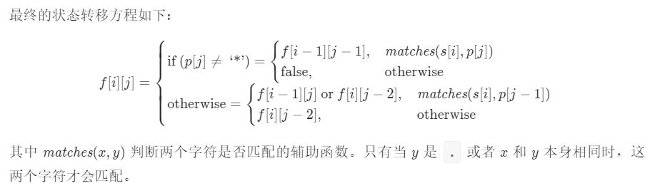

15-三数之和

如果直接三重循环，O(n^3)不可取。双指针方法通常能够降低时间复杂度，如O(n^2) -> O(n)。

注意：遇到相同的元素需要跳过，否则会引入重复的情况。

哈希法空间复杂度可能过高了。

时间复杂度：O(N^2)（排序占用了O(NlogN)），空间复杂度：O(log N)-修改原数组  O(N)-创建新数组

------

16-最接近的三数之和

同样使用双指针，区别在于：每次判断current result和target的位置关系，对应移动second**或**third。

注意：这个answer初始化要看定义的target范围。

时间复杂度：O(N^2)（排序占用了O(NlogN)），空间复杂度：O(log N)-修改原数组  O(N)-创建新数组

------

18-四数之和

双指针，二重循环+双指针。

二重循环中加入极端位置的判断，可减少循环次数。

判断current result和target的位置关系，对应移动最后两个指针。

时间复杂度：O(N^3) (优于O(N^4))

------

31-下一个排列

本题的重点是找出本排列到下一个排列的规律

从左到右找到最后一个相邻升序对(left, right)，最后一个相邻升序对的右侧为单调递减，最小值（**若左右相等，取右边**）与left进行比较，若大于left，则更新right值。

注：为什么要找右侧为单调递减呢？因为单调递减意味着是这一个子序列的最后一个排列情况。设想一个特殊情形：整个序列是逆序的，那么下一个排列就是从头开始的顺序排列。

确定left和right之后，交换对应位置的值，然后对left右侧（单调递减）进行逆序操作（单调递增）

注意：标粗的地方即代码中line 24，e.g. 寻找1,3,3的下一个排列时，1先和后面的3交换，而不是前面的3，然后再做逆序

P.S.：Java中Arrays没有定义reverse()方法，需要自己写

P.S.：一开始自己写的时候用的是Arrays.sort(int[] a, int fromIndex, int toIndex)，时间复杂度不如arrayReverse()操作，并且注意toIndex是不被包括进去的，类似python的range()

时间复杂度：O(N)，空间复杂度：O(1)

------

#### 33-搜索旋转排序数组

核心思想：将数组一分为二，则其中一部分包含旋转点，另一部分不包含。即一部分有序，一部分无序。

通过有序部分的两个端点判断target在哪里，从而确定下一步查找的范围。

注意：寻找旋转点不可取，时间复杂度O(N)。

P.S.：好好练练二分查找的熟练度吧2333

时间复杂度：O(logN)

------

34-在排序数组中查找元素的第一个和最后一个位置

两种实现思路：

- (a) 当产生匹配时，并不结束查找，而是分头向两边寻找是否有比mid更宽的边界
- (b) 首先查找左边界，然后查找右边界

代码细节：

(b)方法写起来更为简洁，但注意求出左边界后要判断左边界是否合法，以及求出右边界需要减1的细节。

时间复杂度：O(logN)

------

39-组合总和

要点：搜索回溯算法，深度优先搜索

深度优先搜索本质是一个递归的过程，回溯部分需要调用递归函数的后面（remove部分）

问题：对原列表排序能否提高效率？应该升序排列还是降序排列？

时间复杂度：O(S)，S为所有可行解长度（但实际上运行过程中还会经历一些不可行的解？e.g.  [2,6,7]  target = 7，那么[2,2,2]会出现在遍历过程中，但实际并不成立）。因此，感觉写成 O(搜索树深度) 更精确，但不够S清晰。

空间复杂度：O(target)，最坏情况1,1,...,1

------

40-组合总和 II

要点：搜索回溯算法，深度优先搜索，39的进阶

与q39最大的不同：如何处理有重复元素的情况？使用q39的方法会导致出现重复结果

解决方案：对原数据排序后，构造一个 <数据 : 频率> 的“字典”（注：对顺序有要求，因此HashMap不可取），对这个字典进行迭代而不是原列表，从而规避重复元素。

在dfs的实现过程中，找出当前元素最多能使用的次数，进行迭代。

注意：dfs的搜索成功判断要放在终止条件前，否则搜索结果不会被加入最终输出（只剩几个空括号......）

时间复杂度：O(N * 2^N)（N为数组长度，一个非常松的上界），最坏的情况下，所有数都不同，且所有数的和小于target，那么所有情况都会被遍历到（早期终止条件不会成立）。最坏情况下，排序时间O(NlogN)可忽略不计。

空间复杂度：O(N)（使用了额外的字典）

------

48-旋转图像

重点：先转置，然后左右翻转

时间复杂度：O(N^2)（以转置为例，交换操作要进行(N^2-N)/2次）

空间复杂度：O(1)

------

54-螺旋矩阵

重点：一圈一圈的迭代，只需不断缩小边界即可。注意边界条件。

时间复杂度：O(mn)，即矩阵中每个元素遍历一次

空间复杂度：O(1)

------

55-跳跃游戏

重点：贪心算法，每次记录最远距离，迭代中若index超过最远距离则无法到达

别把这个问题想太复杂。以及要了解贪心算法：

局部最优解能否推出全局最优解？可以的话贪心算法可行，拆分全局的问题为局部问题。

例如：本题中，对于每一个点，我们能够找到**当前**能够到达的最远距离，在这个点到最远距离的所有点中，我们又去找对于每一个点的最远距离，以此更新能到达的最远距离。最终找到全局最远距离。

时间复杂度：O(N)，N为数组长度

空间复杂度：O(1)

------

5-最长回文子串

重点：动态规划

思路：对于一个回文串，判断该串左右字符是否相等，相等的话则回文串增长。

边界情况：奇数字符回文串（aba），边界情况可认为是只有一个字符；偶数字符回文串（abba），边界情况可认为是相邻两个字符相等

实现过程中的一个细节问题：我是直接创建空字符串，然后通过加法不断更新字符串，似乎这样的运行速度有点慢（但也是能通过的）？

时间复杂度：O(N^2)，极端情况下，向两边扩展的次数为0,1,2,...,N/2,...,2,1,0，求和可知是N^2量级

空间复杂度：O(N)，按我的实现方式，每次用当前回文子串和存储的已知最长子串对比，因此只需要O(N)空间即可

------

62-不同路径

重点：数学思路 or 动态规划

数学思路：可以转化为m+n-2个相同单位中抽n-1个的组合数问题

动态规划：每个点的值等于他左边点的值加上他上面点的值，因此，我们每次保存上一行，就可以计算出这一行的所有结果。

注意：使用Java写组合数计算方法，由于题目中m, n取值较大，不能直接计算m+n-2的阶乘，否则会溢出。应该采取别的计算组合数的方法，所以我代码中的是未通过版本。但主要思想到位了就可以，
重点放在动态规划上吧。

（以下复杂度基于动态规划的实现讨论）

时间复杂度：O(mn)，需要遍历每一个点

空间复杂度：O(2n)，只需要储存当前行和上一行就能进行计算了

------

63-不同路径 II

重点：动态规划

和q62的动态规划思路基本完全相同，加入障碍物：某一点存在障碍物时，该点放弃原有赋值方法，直接取0就可以

注意：注意一下几个边界情况（起点存在障碍物，第一行或第一列存在障碍物，只有一行或一列，只有一个点）

时间复杂度：O(mn)，需要遍历每一个点（和q62是相同的）

空间复杂度：O(2n)，只需要储存当前行和上一行就能进行计算了（和q62是相同的）

------

64-最小路径和

重点：动态规划

思路：本题和q62以及q63没有本质区别。想清楚一点：之前两道题都是从左上到右下求解，本题是从右下往左上求解。

动态规划方程：每一个点的最小路径和 = min(右边邻居的最小路径，下面邻居的最小路径) + 本点的值

时间复杂度：O(mn)

空间复杂度：O(2n)

------

91-解码方法

重点：动态规划

动态规划方程：dp[i] = dp[i-1] * I(i处数字不为0) + dp[i-2] * I(i-1和i处的数字组成合法两位数，即在[10,26]区间内)

代码里留了两种主要思想相同的实现方法，第一种的写法更符合我刚开始的思考方式，第二种使用数组解决问题，更加直观。

时间复杂度：O(N)，遍历整个字符串

空间复杂度：O(1)，第一种写法，只记录前两次的计算结果；O(N)，第二种写法，创建一个数组保留每次计算结果

------

95-不同的二叉搜索树 II

重点：递归 or 动态规划

对比之下，递归还是最容易想到的...

动态规划有两种思路：

- (1) 储存所有的解，即dp[0], dp[1],..., dp[n]，对于dp[i]，确定根节点j后，左边即是dp[j-1]，右边是dp[i-j]加上一个偏差之后的结果

这个思路非常巧妙：这个问题的一个trick在于，例如某次分割下右子树中有i-j个连续元素，这i-j个连续元素生成的BST个数和1,2,...,i-j生成的BST个数相同，结构相同，唯一的
区别就是需要在1,2,...,i-j生成的BST上加上一个偏差值

- (2) 储存上一次计算得到的值，插入一个新的最大值，有且仅有这些情况：作为新的根节点 or 作为根节点的右子树根节点 or 根节点的右子树的右子树的根节点 ... and so on

需要找出最多可以向右走多少步，每走一步均可以生成新的结果

时间复杂度：可行BST的个数为Gn，生成一棵BST时间为O(n)，总体时间复杂度为：O(nGn)，Gn即是数学上的卡特兰数，其增长速度为 4^n / (n^(3/2))，故总时间复杂度为O(4^n / (n^(1/2)))

空间复杂度：O(4^n / (n^(1/2)))，与时间复杂度相同，个人理解：由于增长速度过快，递归所需栈空间 and 方法三动态规划省略的前n-1次结果，都可以忽略不计？（并没有严谨考察）

------

96-不同的二叉搜索树

重点：动态规划

弄懂了q95的动态规划思路(1)，这道题就会非常简单。动态规划方程：dp[i] += dp[j-1] * dp[i-j];  (j from 1 to i)

时间复杂度：O(n^2)，查看代码中循环可知

空间复杂度：O(n)，存储动态规划数组

------

120-三角形最小路径和

重点：动态规划

从上到下求解，只需O(n)空间，每次在原数组上更新值即可。

从右往左更新就可以避免覆盖掉所需数值的问题。每一个点的路径来自于上一行下标相同的点或上一行下标-1的点，因此，从右往左更新时，覆盖掉的点不会用于求下一个点的值。

时间复杂度：O(n^2)

空间复杂度：O(n)

------

139-单词拆分

重点：动态规划

动态规划方程：dp[i] = dp[j] && check(s[j,...,i-1]) （每次加入新字符时，判断和之前所有字符组成的划分能不能被字典中的单词拆分）

注意：j（即划分位置）从右往左会减少查找需要的次数

时间复杂度：O(n^2)，对于长度为n的字符串，有n种划分，因此需要运行1,2,...,n次，故为n^2时间

空间复杂度：O(n)，使用了HashSet以及动态规划数组

------

152-乘积最大子数组

重点：动态规划（特殊）

维护**两个**动态规划数组，一个存储当前连续最大值，一个存储当前连续最小值。

每次引入新数字时，对于最大值DP数组存在这样的情况：最大值更大，最小值变为最大，nums[i]单独最大

对于最小值DP数组则是对应的相反的情况

最后比较最大值DP数组中的数值

时间复杂度：O(n)

空间复杂度：O(n)，常系数为2，引入了两个DP数组

------

6-Z字形变换

重点：字符串处理

使用两个循环固然可行，但并不直观。使用一个储存StringBuilder的List，储存每一行的情况。

只需从头遍历到结尾即可把每个字符加到其对应的行中。（使用了一个布尔变量getDown判断是进入下一行还是上一行，在拐角处修改getDown）

标准答案里创建的行数是取numRows和s.length()的最小值，也可直接写numRows，并不是必须。

时间复杂度：O(N)，N为字符串长度，遍历整个字符串

空间复杂度：O(N)

------

8-字符串转换整数 (atoi)

重点：字符串处理，确定有限状态机（DFA）

做题的时候状态好的话，用if-else判断也没有非常臃肿，但要确保自己考虑到了方方面面。但DFA作为一个更条理更清晰的知识，也建议学习一下。

有限状态机：我的理解是，把字符串的遍历过程中的处理方法作为这个字符串的状态，各个状态组成一个有向图，有固定的转换规则，对于同一状态下的
不同字符均可采用同样的处理方式（见get方法），显得更为简洁。

注意：使用long处理结果以防溢出，负数比较的时候是和 - (long) Integer.MIN_VALUE 比较，因为ans是去掉符号后的结果

时间复杂度：O(N)，N为字符串长度，遍历整个字符串

空间复杂度：O(1)，自动机只需O(1)空间

------

12-整数转罗马数字

重点：贪心算法

两种方法：1) 从最大情况到最小情况依次查找并添加结果；2) 硬编码，把每一位上的所有可能情况列出来

时间复杂度：O(1)，由于题目限定数字的取值范围，因此迭代次数上限是可预知的

空间复杂度：O(1)，额外空间长度不随数字改变而改变

------

17-电话号码的字母组合

重点：DFS，回溯

这道题是非常标准的考察DFS + 回溯的题目，需要自己能够快速写出解答，但是要注意一些细节。

注意：可以在method外定义变量，这样dfs方法的参数会少很多，更加简洁。遇到非2-9的字符需要跳过（这一点标答中似乎没有考虑？）。另一个细节问题，
如果在method内定义变量，把定义的哈希表传入dfs的时候，一定要具体写出内部储存元素的类型，否则会报错的。

时间复杂度：O(3^m x 4^n)，其中m为对应3个字母的数字（2,3,4,5,6,8），n为对应4个字母的数字（7,9），也就是可行解的个数（通常情况下的dfs搜索复杂度）

空间复杂度：O(m + n)，不考虑返回值的情况。空间复杂度取决于：递归深度（m + n），以及哈希表存储空间（常数空间）。

------

#### 10-正则表达式匹配

重点：动态规划

想到对string和pattern同时进行动态规划非常重要。匹配到 * 号既可以是dp[i - 1] [j]，即去除字符串末尾一位后继续匹配，
也可以是dp[i] [j-2]，即 * 号前面那个字符匹配了0次。

动态规划方程如下：



时间复杂度：O(mn)，遍历动态规划数组

空间复杂度：O(mn)

*- 2021.3.12 补充*

做动态规划，千言万语不如一个动态规划方程重要。

------

22-括号生成

重点：DFS，回溯

同样是非常标准的DFS，实现过程中需要注意的一个原则：在一个结果中，从左到右进行统计时，左括号的数量始终大于等于右括号数量，所以我写的时候
加了left和right两个参数示意待添加的左括号和右括号数量

时间复杂度：卡特兰数增长速度为 4^n / (n^(3/2))，复制每一个可行解到结果中需要O(n)时间，故总时间复杂度为O(4^n / (n^(1/2)))

空间复杂度：取决于递归栈的深度，每一层递归函数需要O(1)的空间，最多递归2n层，因此空间复杂度为 O(n)

------

43-字符串相乘

重点：字符串处理，数学问题

方法1：模拟竖式乘法的过程，num1的整体和num2的每一位相乘，然后结果按规则相加

注意：使用StringBuilder或者StringBuffer，数字可直接使用append()方法，append()方法重载了多次（char, int, long, float...），不需要加48后显式转换

时间复杂度（方法1）：O(mn + n ^ 2)，计算乘法过程中需要O(mn)时间，每次阶段结果相加时，字符串最长为m + n，相加n次，因此加法操作需要O((m + n) x n)时间

空间复杂度（方法1）：O(m + n)，存储的字符串的长度最大为O(m + n)

方法2：创建一个长数组，每次维护数组内的值

首先我们需要知道，m位的数字和n位的数字相乘，结果至多为m + n位，至少为m + n - 1位

步骤：

- 第一个数第i位和第二个数第j位相乘，结果进入长数组的i + j + 1位

- 从后往前维护进位

- 最后，长数组转换为字符串输出

时间复杂度（方法2）：O(mn)，观察上述步骤，相乘过程时间复杂度为O(mn)，维护进位和字符串转换需要O(m + n)

空间复杂度（方法3）：O(m + n)，需要一个长数组

------

49-字母异位词分组

重点：哈希表

方法1：每个字符串排序后的结果作为哈希表的key值

方法2：自行构建散列函数，"#2#1...#0"这样的形式

假设字符串数组长度为N，每个字符串长度为K

时间复杂度：O(NKlogK)(方法1)，O(NK)(方法2)，可见排序并不是这个问题中的最优解

空间复杂度：O(NK)

------

71-简化路径

重点：字符串处理，栈和队列

使用字符串的split函数，传入"/"作为参数（注意传入参数必须为字符串）

使用双向队列更容易处理，使用栈亦可。

时间复杂度：O(N)，其中N为最初输入的path长度

空间复杂度：O(N)

------

29-两数相除

重点：32位有符号整数的越界条件判断，指数递增查找，递归

将dividend分别除以divisor的1,2,4,8...倍（可以通过自加运算实现），确定范围后递归查询精确结果

这道题重点在：第一，确定这个**指数递增查找**的思路；第二，判断越界条件。以下重点讲讲越界情况：

- dividend = Integer.MIN_VALUE, divisor = -1    题目条件中说如果除法溢出，返回Integer.MAX_VALUE
- 查询过程中，最后一次查找**一定**越过被除数，因此可能越界 

第二种越界的解决方案：

将dividend和divisor转换为**负数**，当 tmp + tmp > 0 时（tmp是函数中表示当前查找使用的除数的变量），查找越界。

为什么这样做能解决溢出问题呢？

首先需要明确，采用指数方式查找最终解，最后一次的查找是越过dividend的，因此最后一次查找存在越界的可能。

如果发生越界，则有 tmp + tmp 越界，因此加入判断条件 tmp + tmp < 0。

那为什么不全部改为正数进行运算？因为Integer.MIN_VALUE转换成正数会越界的

**2020.1.3 update**

这道题我参考答案的时候没有考虑时间复杂度和空间复杂度的问题

第一次循环的次数应该是 T =  log_2  (|dividend| /  |divisor|) （以2为底），worst case下第二次是 log_2  (dividend /  |divisor|) - 1...   因此总的时间复杂度应该是T^2级别？

例如：求2047除以2时，假设times()表示该操作需要循环次数 times(2047/2)  ->  10 + times(1023/2) -> ...

本质问题在于没有把中间结果保存下来，因此可以考虑用额外空间换时间，这样下来时间和空间都是O(T)

不过如果要用额外空间的话，查询过程中也不能顺序查找吧...这样反而太曲折了，不如原答案来得直白

------

50-Pow(x, n)

重点：快速幂算法，递归，迭代

递归：把求x的n次幂转换为求x的n/2次幂问题

迭代：借助二进制表示n，从而迭代计算

时间复杂度：O(log N) - both

空间复杂度：O(log N) - 递归（栈空间）  /  O(1) - 迭代

------

166-分数到小数

重点：代码规范，哈希表

实现长除法，注意代码细节及各种边界情况：被除数为0、有负数、无小数部分、越界、小数部分存在循环

使用哈希表存储每个余数对应的“出现位置”，更准确说是将来要被左括号插入的位置

使用Math.abs()转换Integer.MIN_VALUE的时候，要先加上Long.valueOf()，否则Math.abs()根据参数本身的类型推断返回结果类型可能出错

------

168-Excel表列名称

重点：取余

有一个关键的地方：1-26表示A-Z，然而如果直接除以26取余，Z会成为特例，因此先减1然后取余

------

98-验证二叉搜索树

重点：二叉树的遍历

中序遍历，如果本次得到的值小于等于上一个值，则不是二叉搜索树

时间复杂度：O(n)，n为二叉树节点个数，一次遍历每个节点访问一次

空间复杂度：O(n)，worst case下栈中最多需要存储n个节点

------

102-二叉树的层序遍历

重点：二叉树的遍历，层序遍历

时间复杂度：O(n)，n为二叉树节点个数

空间复杂度：O(n)

------

103-二叉树的锯齿形层序遍历

重点：二叉树的遍历，层序遍历

在102的基础上加一个判断顺序的变量，每层改用双端队列

时间复杂度：O(n)，n为二叉树节点个数

空间复杂度：O(n)，渐进复杂度了，并不是太精确感觉（毕竟队列中最多只有两层的节点）

------

#### 105-从前序与中序遍历序列构造二叉树

重点：二叉树的遍历，前序遍历，中序遍历

**递归**的做法比较容易想到，只需要知道前序遍历和中序遍历的特点：

前序遍历：[root，左子树，右子树]

中序遍历：[左子树，root，右子树]

实现细节：用一个哈希表存储每个值在inorder中出现的位置，方便快速查找。

时间复杂度：O(n)，n为二叉树节点个数

空间复杂度：O(n)，哈希表需要O(n)额外空间，递归栈空间O(h)（树深度）小于n，因此总体为O(n)

**迭代**的做法比较取巧

[官方解答](https://leetcode-cn.com/problems/construct-binary-tree-from-preorder-and-inorder-traversal/solution/cong-qian-xu-yu-zhong-xu-bian-li-xu-lie-gou-zao-9/)非常详细，值得参考。

我个人理解的大致思路是这样的：

如果存在一棵只有左儿子的树，那么它的前序和中序结果顺序是**完全相反**的，如果在任意位置插入一个右儿子，对于前序遍历：右儿子在尾部。对于中序遍历：右儿子在**其父节点右边**。从这样一个性质中我们有这样的启发：

遍历前序结果，在出现与中序起点相同的结果后，代表这个一直向左的分支走到了尽头。接下来只需要找下一个节点是哪一个节点的右儿子：方法是使用栈存储前序遍历之前的所有结果，不断推出栈内元素的过程应该一直与中序遍历相同，出现不同的时候就是右儿子应该被插入的位置。

时间复杂度：O(n)，n为二叉树节点个数

空间复杂度：O(n)，最多有n个元素被推入栈中

------

#### 106-从中序与后序遍历序列构造二叉树

重点：二叉树的遍历，中序遍历，后序遍历

**递归**的做法和q105略有不同。从后序遍历的尾部向前查询，只需要不断将postorderIndex减1，并先生成右子树，再生成左子树即可。（但完全按照q105的思路应该也能做？）

**迭代**的做法和q105思想基本相同。只不过要从后往前迭代。

时间复杂度：O(n)，两种做法都是O(n)复杂度

空间复杂度：O(n)

------

113-路径总和 II

重点：深度优先搜索，广度优先搜索

注意：DFS写简洁一点，java实现每次添加结果时要使用new关键字，回溯时记得删除操作

时间复杂度：O(n)，n为节点个数（虽然官方解答是n^2，但我更倾向于认同：每个节点只被增删一次）

空间复杂度：O(n)，取决于栈空间深度，最多不超过n

------

114-二叉树展开为链表

重点：二叉树

解决本题的关键在于理解二叉树是如何展开的：左子树最右最下的叶节点是右子树的父节点。然后根据这一点不断将左子树置空即可。

时间复杂度：O(n)，我认为worst case是一棵只有左儿子的二叉树，需要O(n)的移动操作次数

空间复杂度：O(1)，毕竟作为原地算法也不需要什么额外空间

------

116-填充每个节点的下一个右侧节点指针

重点：广度优先搜索，迭代

**BFS**的解法非常直观、简单，但空间复杂度不足（P.S.：层次遍历的重点在于用一个size变量记录本层有多少个节点）

时间复杂度：O(n)，每个节点存取一次

空间复杂度：O(n)，取决于队列需要的空间大小。完美二叉树最后一层有n/2个节点

第二种解法更好：通过上一层已建立的next指针，不断向右迭代构造新的next指针。这样做的理由在于，构造next指针其实只有两种情况：

- 同一个父节点下的左儿子通过next连接右儿子，即 node.left.next = node.right
- 节点的右儿子通过next连接该节点的next节点的左儿子，即 node.right.next = node.next.left

时间复杂度：O(n)，每个节点都会被遍历一次

空间复杂度：O(1)

------

117-填充每个节点的下一个右侧节点指针 II

重点：广度优先搜索，双指针

BFS和q116基本相同。

迭代的解法本质上是**双指针**，由于题目条件不再是完美二叉树，我们需要维护一个指示下一层的nextStart指针，以及一个指示本层前一个节点的last指针。

时间复杂度：O(n)

空间复杂度：O(1)

------

129-求根到叶子节点数字之和

重点：深度优先搜索

简单的DFS。（P.S.：这种问题就没必要搞回溯了）

时间复杂度：O(n)，每个节点访问一次

空间复杂度：O(n)，取决于栈空间深度，即二叉树深度，worst case二叉树深度为n

------

144-二叉树的前序遍历

重点：二叉树，前序遍历

**递归**的解法非常简单。

**迭代**的解法我目前看到了两个版本：

- 第一种是每次从栈中取出一个节点后，先后push右儿子和左儿子
- 第二种是每取得一个节点，一直向左走，将路径上的儿子全部push入栈，取出一个后再向右走（具体看代码就明白了）

Morris遍历之后有空的话可以看一下。

时间复杂度：O(n)，递归和迭代都是

空间复杂度：O(n)，递归和迭代都是

------

145-二叉树的后序遍历

重点：二叉树，后序遍历

**递归**略。

**迭代**的解法：使用一个prev指针指示是否已经遍历当前节点的所有左儿子和右儿子

时间复杂度：O(n)，递归和迭代都是

空间复杂度：O(n)，递归和迭代都是

------

173-二叉搜索树迭代器

重点：迭代器，二叉树，中序遍历

*题目要求：next() 和 hasNext() 操作的时间复杂度是 O(1)，并使用 O(h) 内存，其中 h 是树的高度。*

从小到大遍历一个二叉搜索树，应该立刻想到**中序遍历**

**递归**解法就是额外创建一个List存储中序遍历结果，供next()调用就可以了

**迭代**解法就是额外创建一个栈，在调用next()时不光要返回数值，还要将当前节点右儿子及其所有左儿子一并推入栈中

时间复杂度：next() -- 递归解法O(1) / 迭代解法worst caseO(n)，均摊O(1)；hasNext() -- 均为O(1)

空间复杂度：递归解法O(n)额外空间 / 迭代解法O(h)，取决于BST高度

------

199-二叉树的右视图

重点：深度优先搜索，广度优先搜索

BFS解法非常容易想到。

DFS解法就是按照先右子树后左子树的方法搜索，加一个判断：当前深度是否初次到达，如果是初次到达那么此时的节点就是本层最右节点。

时间复杂度：O(n)，both

空间复杂度：O(n)，both

------

222-完全二叉树的节点个数

重点：二分查找，位运算

深度优先搜索显然没有利用完全二叉树的性质。

假设root在第0层，最深层为h。那么完全二叉树的节点范围在[2^h, 2^(h+1)-1]。只需要在这个范围内二分查找即可。

那么对于一个固定的值k，怎么知道第k个节点存不存在？使用Huffman树的特点，取得k的二进制表示，从高位到低位，除去最高位恒为1以外，0向左走，1向右走

注意：二分查找还是不熟练，条件为low < high时，取mid时需要向右取整，否则不收敛

注意：位运算优先级低于加减法，记得打括号

注意：root为第0层，不是第1层

时间复杂度：O(log2(n))，n为二叉树节点个数

空间复杂度：O(1)

------

226-翻转二叉树

重点：递归

时间复杂度：O(n)

空间复杂度：O(n)

------

230-二叉搜索树中第K小的元素

重点：中序遍历

时间复杂度：O(n)

空间复杂度：O(n)

------

235-二叉搜索树的最近公共祖先

重点：二叉搜索树

比较root、p、q储存的值，若root值在二者之间则root即为结果，否则向左或向右继续查找。

另一种做法：两次遍历，得到两条路径，找到路径最后一个相同的节点。

时间复杂度：O(n)

空间复杂度：O(1)，如果用两次遍历的做法就是O(n)（不划算）

------

236-二叉树的最近公共祖先

重点：递归，深度优先搜索

暴力一点的解法：DFS找到p和q的路径，比对路径

温和一点的解法：和q235思路相同，只不过需要用一个返回boolean的DFS判断root是否在p、q之间

温和解法中，有两种情况root为结果（本质就是q235）

- p和q一个在root的左子树，一个在root的右子树

- p和q一个就是root，另一个在root的子树中（左右均可）

官方解法中还有一个思路：用一个哈希表存储 所有节点 -> 父节点 的映射关系，不断向上查找获得路径，但我觉得和DFS暴力解法思路有较为相似之处：都是获得p和q的路径。

时间复杂度：O(n)，DFS遍历每个节点一次

空间复杂度：O(n)，DFS的worst case栈空间O(n)。暴力解法需要存储路径，在常系数上比温和解法差

------

109-有序链表转换二叉搜索树

重点：分治，快慢指针，中序遍历

要构建高度平衡的BST，取链表中点作为root，左侧构建左子树，右侧构建右子树，这就形成了一个分治问题。

接下来的问题无非是如何取得链表中点：

- 解法1：快慢指针，O(n)复杂度
- 解法2：利用中序遍历特点，先生成左子树，然后是root，最后生成右子树，那么生成的root顺序一定和链表顺序是相同的，O(1)复杂度

时间复杂度：

- 解法1：递推公式 T(n) = 2 T(n/2) + O(n)，解得O(nlog(n))（计算方法：两边同时除以n）
- 解法2：递推公式 T(n) = 2 T(n/2) + O(1)，解得O(n)

空间复杂度：O(log n)，递归栈空间

------

130-被围绕的区域

重点：深度优先搜索，广度优先搜索

思路：从边界开始搜索，搜索得到的O点一定没有被围绕。使用额外的标记A代替O标记未被围绕的元素。

~~BFS本质就是把DFS的栈空间实现。~~（修正之前的错误理解...怎么可能一样呢）

注意：Java创建新的数组对象要用new，这一点BFS会用到

时间复杂度：O(hw)，h为矩阵高，w为矩阵宽

空间复杂度：O(hw)

------

#### 131-分割回文串

重点：深度优先搜索，回溯

思路：每次截取一个回文串（通过循环及判断找出），然后继续向后搜索，到达末尾后进行回溯。

题解的作者用了一个动态规划去判断回文串

时间复杂度：存疑，之后可以分析一下

空间复杂度：递归栈深度最大为O(N)，N为字符串长度。如果使用动态规划去判断回文串那就用了O(N^2)额外空间

------

133-克隆图

重点：深度优先搜索，广度优先搜索

使用一个哈希表记录当前节点是否被访问过，如果已经访问过则返回哈希表存储结果。

时间复杂度：O(n)，其中n为图中节点个数

空间复杂度：O(n)

------

200-岛屿数量

重点：深度优先搜索，广度优先搜索

本质上就是先循环遍历网格中所有点，发现陆地（标记为1的点）则找出所有与该点连通的点并置0。

时间复杂度：O(mn)

空间复杂度：O(mn)（DFS） 、  O(min(m, n)) （BFS）

------

995-K连续位的最小翻转次数

重点：贪心算法，差分数组，滑动窗口

这道题的本质是贪心算法，我们从数组的头部向尾部遍历，每次遇到0就进行翻转，这样得到的解正是最优解。

但是如果暴力解决，即真的对数组元素进行翻转，那么时间复杂度会达到O(NK)，这是不能接受的。

- 解法1：使用差分数组diff

用一个revCnt变量，储存当前需要匹配的数字（初始为0）。试想一下，如果我们在某一点处匹配了0，即需要在此处进行翻转，那么接下来的点则应该匹配1进行翻转。

但是一个K连续位的翻转只应该作用在[i, i + K - 1]的范围内。到i + K处就失效了，因此应该令diff[i + K]取反（注：指literally取反，不是~代表的按位取反）。这样的话，运行到i + K处的时候，revCnt ^= diff[i + K]，就可以正确得到当前位置需要匹配的值。

*以上是我个人的理解，下面尝试按照差分数组的思想来解释：*

按照官方题解的思路，差分数组diff是对于当前位置元素翻转次数的差分，因此对[i, i + K - 1]进行翻转的时候，只有diff[i]和diff[i+K]需要修改。

revCnt表示累加差分数组得到的当前位置需要翻转的次数。

对diff[i]的修改体现在revCnt ^= 1.

对diff[i + K]修改则是直接diff[i + K] ^= 1，再通过revCnt ^= diff[i]即是一个求和的步骤。

而当i + K > n时，无法执行翻转操作，返回-1

- 解法2：滑动窗口，改进空间复杂度

在解法1中我们使用了差分数组，需要额外的O(N)空间。而如果直接在原数组上进行修改，则可以优化空间复杂度。做法则是对A[i] += 2记录i处发生翻转，revCnt ^= diff[i]的步骤变成查询A[i - K]是否大于1

时间复杂度：暴力解法O(NK)，解法1和解法2 O(N)

空间复杂度：暴力解法O(1)，解法1 O(N)，解法2 O(1)

------

1004-最大连续1的个数 III

重点：滑动窗口

具体做法是，把现在的问题明确为：寻找一个最长的子数组，其中最多有K个元素为0。

因此解法1中，在移动左右端点时，我们同时维护一个lsum和一个rsum，用来储存从头部到左端点以及右端点的0的个数。两者差小于等于K时满足条件。

*在此加入 [@负雪明烛](https://leetcode-cn.com/problems/max-consecutive-ones-iii/solution/fen-xiang-hua-dong-chuang-kou-mo-ban-mia-f76z/) 分享的滑动窗口问题的解法思路以及模板如下：*

滑动窗口中用到了左右两个指针，它们移动的思路是：**以右指针作为驱动，拖着左指针向前走。右指针每次只移动一步，而左指针在内部 while 循环中每次可能移动多步。右指针是主动前移，探索未知的新区域；左指针是被迫移动，负责寻找满足题意的区间。**

模板如下：

```python
def findSubArray(nums):
    N = len(nums) # 数组/字符串长度
    left, right = 0, 0 # 双指针，表示当前遍历的区间[left, right]，闭区间
    sums = 0 # 用于统计 子数组/子区间 是否有效，根据题目可能会改成求和/计数
    res = 0 # 保存最大的满足题目要求的 子数组/子串 长度
    while right < N: # 当右边的指针没有搜索到 数组/字符串 的结尾
        sums += nums[right] # 增加当前右边指针的数字/字符的求和/计数
        while 区间[left, right]不符合题意：# 此时需要一直移动左指针，直至找到一个符合题意的区间
            sums -= nums[left] # 移动左指针前需要从counter中减少left位置字符的求和/计数
            left += 1 # 真正的移动左指针，注意不能跟上面一行代码写反
        # 到 while 结束时，我们找到了一个符合题意要求的 子数组/子串
        res = max(res, right - left + 1) # 需要更新结果
        right += 1 # 移动右指针，去探索新的区间
    return res
```


解法2则更加巧妙（原答的写法也确实简洁不太易懂）。维护的是一个**单调递增**的窗口，把K视作可以分配的资源。

- 当K >= 0时，窗口右端点向右前进。
- 当K < 0时，窗口左右端点同时向右前进，即平移窗口。

在上述过程中，如果右端点向右的过程中遇到0，则消耗K。如果左端点向右的过程中经过一个0，则返还K。

时间复杂度：O(N)

空间复杂度：O(1)

------

697-数组的度

重点：哈希表，滑动窗口

解法1，哈希表思路：用哈希表存储每个数出现的次数、第一次出现位置、最后一次出现位置，最终遍历哈希表求解。

解法2，滑动窗口思路：第一次遍历获得最大频数，第二次遍历使用一个新的数组重新计数：

- 当前右端点的值的计数 < 最大频数，则右端点向右扩充
- 当前右端点的值的计数 = 最大频数，则左端点向右收缩，直至当前右端点计数 < 最大频数

时间复杂度：O(N)，其中N为整数数组长度。两种解法都需要遍历数组，解法1和解法2都需要两次遍历（解法1可以优化到只1次遍历）。

空间复杂度：O(N)，但观察代码可知解法2相对需要的额外空间更少，效率也更高。

------

1438-绝对差不超过限制的最长连续子数组

重点：滑动窗口，有序集，单调队列

本题很容易想到滑动窗口算法，但问题在于怎样维护当前子数组中的最大值和最小值。如果每次都循环去寻找最大值和最小值的话，显然效率十分低下。因此有两种解法：

- 使用有序集合存储当前子数组中的元素，平衡树 - 例如Java中的TreeMap（底层实现为红黑树）

- 使用两个单调队列，一个存储最大值，一个存储最小值。这里我一开始看的时候没明白为什么在插入队列中时可以将当前元素后面的元素全部删掉。但仔细一想就会明白，当前元素后面的元素必定会先出队列，因此已经不再起作用了

时间复杂度：O(nlog n) - 解法1（树每次插入元素需要log n时间） /   O(n) - 解法2

空间复杂度：O(n)，两种解法都是O(n)

------

766-托普利茨矩阵

重点：遍历

思路：遍历除了矩阵第一行和第一列外的所有元素，每个元素和自己左上方的元素比较

时间复杂度：O(mn)，其中m和n为矩阵的行数和列数

空间复杂度：O(1)

------

1052-爱生气的书店老板

重点：滑动窗口

先求不使用技能的满意顾客数，再使用滑动窗口求最大值

时间复杂度：O(n)，其中n为店老板工作时间，即数组长度

空间复杂度：O(1)

------

832-翻转图像

重点：双指针

本题唯一要点就是：不需要完全按照先翻转后反转来实现。考虑左右不同时，水平翻转再反转相当于不变。而左右相同时，只需要各自反转即可。

时间复杂度：O(n^2)

空间复杂度：O(1)

------

867-转置矩阵

重点：数学

没什么好说的，注意行和列长度不一定相等就行。

时间复杂度：O(mn)，m和n分别为行和列长度

空间复杂度：O(1)，不包括答案矩阵需要的空间

------

99-恢复二叉搜索树

重点：中序遍历，深度优先搜索（次要）

由于中序遍历是有序的，因此寻找中序遍历中出现的逆序情况，就可以找出错误的节点。

逆序情况会出现1到2次（如果两个错误节点在中序上相邻则1次，否则2次）。

- 解法1：使用列表存储中序遍历结果，遍历列表找出错误节点的值，通过值搜索错误节点

- 解法2：在中序遍历的过程中直接比较上一个节点和当前节点值（相比解法1优化时间复杂度常数项以及空间复杂度）

**解法3：Morris遍历（待补充）**

时间复杂度：解法1和解法2都是 O(n)，相比之下解法1常数项更优

空间复杂度：解法1 - O(n)，解法2 - O(n) worst case / O(h) general case

------

1178-猜字谜

重点：位运算，二进制状态压缩

我们使用长度为26的二进制数来表示word和puzzle

通过遍历words获得二进制数的计数哈希表（筛除长度大于puzzle的词），然后遍历puzzles，每一个puzzle使用其后六个字母的二进制前面加上一个1（必须匹配首字母）来表示。

对于每个puzzle，需要枚举其后六位的子集来确定所有可能的情况。

时间复杂度：O(m|w| + n2^|p|)，其中m和n分别是数组words和puzzles的长度

空间复杂度：O(m)

------

395-至少有K个重复字符的最长子串

重点：分治

- 解法1：分治

对于一个字符串s，如果其中某个字符ch的频率小于k，那么所有包含ch的子串都不可能是结果。因此，ch就起到了划分字符串的作用。

接下来，我们继续在划分后的字符串中重复上一步，直到找不到可划分的字符，就可以得到一个可能的结果（需要比较所有满足条件的子串的长度并求最大）。

时间复杂度：O(N * 26)，每次递归会忽略掉一个用于分割的字符，因此最多递归26层。第一层遍历N次，其他对应层遍历次数之和的上界为N。

空间复杂度：O(26^2)，递归深度为O(26)，每层递归需要开辟O(26)额外空间。（注：因为这里只有小写字母，所以字符集长度为26，否则此处及以上的26需要替换为字符集长度）

- 解法2：滑动窗口

做法是：枚举最长子串中的字符种类数量，本题中为[1, 26]，对于每个字符种类数量，滑动窗口维护的正是这个值，在这个过程中统计当前窗口中不满足条件（频率在(0,k)之间）的字符种类数量。当不满足条件的种类为0时，可以将当前窗口长度与已记录的最长窗口长度进行比较。

时间复杂度：O(26 * N + 26 * 26)，官方解答中说后面的 26 x 26 是初始化计数数组时的复杂度，但似乎解法1的复杂度计算的时候没有统计这一复杂度？

空间复杂度：O(26)

------

896-单调数列

重点：遍历

一次遍历即可解决问题：巧妙利用或运算

时间复杂度：O(n)

空间复杂度：O(1)

------

303-区域和检索 - 数组不可变

重点：前缀和，动态规划

如果每次调用sumRange时通过循环计算区域和的话，复杂度太高，是O(j - i)

因此寻找O(1)时间的解：储存数组的前缀和

实现细节：前缀和长度为 n + 1 （sums[i] 是从索引0到i-1的和）

时间复杂度：初始化O(n)，检索O(1)

空间复杂度：O(n)

------

124-二叉树中的最大路径和

重点：深度优先搜索，递归

一条路径一定有一个顶点。以某个节点为顶点的最大路径和就是 它向左的最长单向路径和 加上 它向右的最长单向路径和。

因此引入一个计算贡献值的函数，贡献值就是当前节点为起点向左的单向路径和向右的单向路径比较后的最大值。

所谓最大路径和就是左右子节点贡献值之和加上当前节点的值。

在这个过程中维护全局的最大路径和。

时间复杂度：O(N)

空间复杂度：O(N) - worst case / O(H) - general case

------

207-课程表

重点：图，深度优先搜索，广度优先搜索

标准的图的搜索问题。

**解法1：深度优先搜索**

关键就是判断这个图是不是**有向无环图**。如果存在环的话，就一定无法完成所有课程的学习。

实现细节：

- 使用邻接表edges存储所有课程信息，即完成 先修课 - 所有子课程 的对应。

- 使用visited存储节点状态。0 - 未访问；1 - 正在访问；2 - 已访问（关于图搜索的题目常见套路）

时间复杂度：O(n + m)，其中n为课程数，m为先修课程要求数

空间复杂度：O(n + m)，邻接表和状态数组需要额外空间，递归复杂度O(n)

**解法2：广度优先搜索**

找出所有没有先修课的课程，也就是可以直接学习的课程。

然后找这些课程的子课程，最后看是不是所有课程都可以直接学习。

时间复杂度：O(n + m)

空间复杂度：O(n + m)，邻接表和状态数组需要额外空间，队列最长复杂度O(n)

------

210-课程表 II

重点：图，深度优先搜索，广度优先搜索

参考q207，基本相同。

注意：使用DFS时，结果的存储顺序应该是从后往前。

时间复杂度：O(n + m)

空间复杂度：O(n + m)

------

剑指Offer 03-数组中重复的数字

重点：遍历

用数组、哈希表、集合都可以。

（考察的是沟通能力，既可以用哈希表解题，又可以排序判断相邻元素解题时，需要问面试官具体时间、空间复杂度的限制）

时间复杂度：O(n)

空间复杂度：O(n)

------

#### 剑指Offer 04-二维数组中的查找

重点：线性查找

暴力解法时间复杂度O(mn)不能接受。

从左上方开始查找，无论向右还是向下都是增加。而从左下方或者右上方开始查找，一个方向是增加，另一个方向减少。因此可以在O(m + n)时间解决问题。

时间复杂度：O(m + n)

空间复杂度：O(1)

------

剑指Offer 05-替换空格

重点：遍历

Java使用StringBuilder会比较方便。

时间复杂度：O(n)，遍历字符串s一遍

空间复杂度：O(1)（如果不考虑答案字符串的话）

------

304-二维区域和检索 - 矩阵不可变

重点：前缀和，动态规划

本题是q303的进阶版，因此二维前缀和的解法和q303思路基本相同。同样，实现过程中前缀和数组的两个维度都多留出一位。

主要难点在于正确使用索引。在我的实现中，sum数组的i, j索引代表原矩阵中[0, i - 1] x [0, j - 1] 的前缀和。

时间复杂度：初始化O(mn)，检索O(1)

空间复杂度：O(mn)

------

338-比特位计数

重点：动态规划，位运算

本题仔细观察的话，可以找出规律，写出O(n)时间的解答不难。以下是三种动态规划的思路。

动态规划的特点：使用之前计算过的结果得到当前位置的解。

- 思路1：计算当前的数与 小于当前数的最大2的幂 的差。以8为例，二进制表示是1 0 0 0，那么从8到15的过程中，最高位始终是1，只有后三位从0 0 0到1 1 1在变化，这就是为什么会有 `bits[i] = 1 + bits[i - highBit]`

- 思路2：i >> 1会把最右边一位去掉，i >> 1之前已经计算过。只需要判断当前 i 的最后一位是1还是0就行（可以使用 i & 1），因此有`bits[i] = bits[i >> 1] + 1`

- 思路3：i & (i - 1)可以去掉 i 最右边的一个1，并且 i & (i - 1)一定小于 i，因此有 `bits[i] = bits[i & (i - 1)] + 1`

时间复杂度：O(n)

空间复杂度：O(1)

------

剑指Offer 06-从尾到头打印链表

重点：栈，递归

实现细节：Java的Stack.toArray()是按push顺序输出的，还是要用一个循环把Stack中元素取出。

时间复杂度：O(n)

空间复杂度：O(n)，遍历链表两遍的做法可以把空间优化到O(1)

------

剑指Offer 07-重建二叉树

本题和[q105](#105-从前序与中序遍历序列构造二叉树)完全相同，递归和迭代两种解法均可参考该处笔记。

*2021.06.04补充*

关于递归，我每次设置left和right总以为是对于preorder而言，因此出错。补充来自leetcode评论的一点：这里面的 left 和 i 还有 right 都是用来给 inorder 中序遍历处理边界的，
不要直接用来给 preorder 确定根节点。

------

#### 300-最长递增子序列

重点：动态规划，贪心，二分查找

- 解法1：dp[i]维护前 i 个元素中，以第 i 个元素结尾的最长递增子序列

动态规划方程为：dp[i] = max(d[j]) + 1   (j < i 并且 nums[i] > nums[j])。最终动态规划数组中的最大值就是结果。

时间复杂度：O(n^2)

空间复杂度：O(n)

- 解法2：贪心算法。维护的数组 d 是最终的最长递增子序列。每次考虑一个新的元素时，我们希望序列**上升得尽可能慢**。

因此，当新的元素大于当前数组 d 最后一个元素是，新元素添加至末尾；否则，使用二分查找寻找 d[i - 1] < nums[j] < d[i]，并更新 d[i] = nums[j]

时间复杂度：O(n log n)

空间复杂度：O(n)

------

354-俄罗斯套娃信封问题

重点：动态规划，贪心，二分查找

由于信封具有w和h两个维度，我们对其中一维进行排序后，对另一维进行判断。此时问题转化为一维的求最长递增子序列问题，即[q300](#300-最长递增子序列)。

注意，当第一维出现相等的情况时，例如[1, 1]和[1, 2]，如果我们只判断第二维，会得到错误的结果。解决方法是：第一维升序排列，出现相等情况时按第二维降序排列。经过降序处理后，即使第一维相同，在这些相同的信封中也只有一个会被纳入结果中。

其余部分与[q300](#300-最长递增子序列)基本相同，个人觉得本题的二分查找写法相对后者更清晰，但本质上都一样。

时间复杂度：解法1 - O(n ^ 2)；解法2 - O(n log n)

空间复杂度：O(n)

------

#### 232-用栈实现队列

重点：栈

由于栈的后进先出特性，相当于使原来数据的顺序颠倒。那么数据连续经过两个栈，即可还原其顺序，得到我们需要的队列。

时间复杂度：`push`和`empty`复杂度O(1)，`peek`和`pop`均摊O(1)（每个元素至多入栈出栈两次）

空间复杂度：O(n)

------

剑指Offer 09-用两个栈实现队列

重点：栈

参见[q232](#232-用栈实现队列)，注意数据从输入栈转移到输出栈的时机（输出栈为空）。

------

剑指Offer 10-I-斐波那契数列

重点：动态规划

DP入门题目。（注意这道题需要取模）

*2020.06.04补充*

注意：python中`1e9 + 7`这样的表达是浮点数，建议还是直接`1000000007`

------

剑指Offer 10-II-青蛙跳台阶问题

重点：动态规划

DP入门题目。

------

503-下一个更大元素 II

重点：栈，单调栈

维护一个**单调栈**，所谓单调栈，比较形象的理解就是一个Hanoi塔，越靠近栈顶的元素越小。引入一个新的元素时，将所有比这个元素小的元素从栈内弹出，此时当前元素就是这些被弹出元素的下一个更大元素（因为直到遇到当前元素之前，这些被弹出元素后面入栈的元素都小于这些被弹出元素）。

实现细节：栈内存储下标，为了寻找最后一个元素的下一个更大元素，遍历时候复制数组的前n - 1个元素到后面（可以通过下标取模实现）

时间复杂度：O(n)

空间复杂度：worst case下，原数组降序，栈内最多会存储n个元素

------

132-分割回文串 II

重点：动态规划

本题是[q131](#131-分割回文串)的进阶版。第一步的处理和[q131](#131-分割回文串)的解法2是相同的，即使用动态规划，用一个二维布尔数组表示当前字符串中所有的回文串情况。

接下来，用一个数组f，其中 f[i] 表示字符串的子串s[0...i]的**最小**分割次数，当子串s[0...i]就是回文串时，f[i] = 0.否则可得动态规划方程：f[i] = min(f[j] + 1)（j = 0, ... , j - 1 且 s[j + 1, ... , i]是回文串）。

时间复杂度：O(n^2)

空间复杂度：O(n^2)

------

剑指Offer 11-旋转数组的最小数字

重点：二分查找

通过不断和**右端点**进行比较，确定最小数字在哪个区间中。

注意：当重复情况存在时，high和mid所在位置的数值相等，令high自减1，因为mid还在区间内，所以一定不会出错。

注意：和low比较就会有一些特殊情况需要考虑......例如，[1, 2, 3, 4, 5] 以及 [10, 3, 10, 10, 10]，非常的裂开。

时间复杂度：没有重复元素时，O(log n)。存在重复元素时，worst case O(n)，即所有元素相同。平均复杂度O(log n)

空间复杂度：O(1)

------

剑指Offer 12-矩阵中的路径

重点：深度优先搜索

遍历矩阵，对于每个元素作为起点进行DFS。

由于元素不可重复使用，需要用到回溯。如果可以修改原矩阵，先用空字符修改。如果不可以修改原矩阵，新建一个visited矩阵或者新建一个哈希表（个人想法）。

时间复杂度：O(3^k mn)，其中k是字符串长度，也就是路径长度。矩阵中有mn个起点，对于每个起点，最多需要遍历3^k次。

空间复杂度：O(k)，栈空间深度，最坏情况下k = mn.

------

剑指Offer 13-机器人的运动范围

重点：深度优先搜索，广度优先搜索，动态规划

三种解法，重点都是判断两点：第一，该点是否可以到达；第二，该点处的值是否满足要求。

在本题中，我们只需要向右和向下搜索（原因是，数位和在10x10的范围内从左上向右下递增）

时间复杂度：O(mn)，任何解法都需要判断每一个点

空间复杂度：O(mn)

*2021.06.04补充*

计算数位和的优化方式：假设i的数位和为si，则i+1的数位和为 `(si + 1) if (i + 1) % 10 else (si - 8)`。

无论是DFS还是BFS，带上i和j的数位和作为参数or队列内元组组成部分，都是比较好的选择。

------

1047-删除字符串中的所有相邻重复项

重点：栈

使用栈储存字符串中还未被删除的字符，每次和栈顶比较即可。

时间复杂度：O(n)，遍历字符串

空间复杂度：O(1)，如果栈考虑作为结果不计算复杂度的话，否则O(n)

------

#### 224-基本计算器

重点：栈，数学

做过括号匹配的话，很容易想到会用**栈**来处理这个问题，但是刚看到这道题的时候陷入思维定势，在想把括号推入栈中的话怎么处理这一问题。

但实际上，由于本题限制运算符只有 + 和 -，可以根据括号的规则将括号展开。也就是，括号前为减号的话，括号内所有运算符号取反。

因此，正确的处理方式是，当出现左括号时，把当前符号使用+1或-1的形式存在栈内，括号内的运算符通过peek栈顶来确定自己是否取反。

时间复杂度：O(n)

空间复杂度：O(n)

------

剑指Offer 16-数值的整数次方

重点：快速幂，位运算

使用快速幂算法，即 n 为偶数时，x ^ n = (x ^ 2) ^ (n / 2)；n 为奇数时，x ^ n = x ^ (x ^ (n - 1))。据此可以写出递归和迭代两种解法。

注意：Java中 n 取Integer.MIN_VALUE时，存在越界问题，需要用一个新的 long 变量存储，或者在递归中做一个简单的处理 `myPow(1 / x, -(n + 1)) / x`。

注意：`long b = -n;`的写法是错误的，仍然会越界。

时间复杂度：O(log n)

空间复杂度：O(1) - 迭代；O(log n) - 递归，栈空间深度

*2021.06.04补充*

快速幂算法，类似的问题参考[剑指Offer 14 剪绳子II](#剑指Offer-14---II-剪绳子-II)。

注意：快速幂中写 `x *= x`，而不是`x = x ** 2`，后者在测试用例2.00000的-2147483648次方出现OverflowError。

------

227-基本计算器 II

重点：栈

由于乘除法的优先级高于加减法，我们考虑将数字存入栈中。只在出现乘除法时运算，最后在一起计算栈内的元素。

- 出现加号，接下来的数字推入栈中
- 出现减号，下一个数的相反数推入栈中
- 出现乘除号，下一个数和栈顶元素运算

时间复杂度：O(n)，遍历字符串一次，遍历栈一次

空间复杂度：O(n)，需要的栈空间

------

331-验证二叉树的前序序列化

重点：栈

当我们引入一个非空节点时，这意味着我们需要用两个新的节点（空或非空）作为该节点的子节点，可以理解为，一个新的非空节点，在消耗一个**槽位**的同时引入了两个新的**槽位**。

当我们引入一个空节点时，只需要消耗一个**槽位**。

因此，我们可以使用栈存储各节点的槽位情况。遇到非空节点时，栈内推入一个2.遇到空节点时，栈顶元素减1.如果栈顶元素为0则移除。

更简化的是解法2，只需要用一个slots变量记录剩余槽位数，达到优化空间复杂度的目的。

时间复杂度：O(n)，n为字符串长度

空间复杂度：O(n) - 解法1；O(1) - 解法2

------

剑指Offer 18-删除链表的节点

重点：链表

注意特殊情况处理，用两个指针即可解决问题。

时间复杂度：O(n)

空间复杂度：O(1)

------

剑指Offer 21-调整数组顺序使奇数位于偶数前面

重点：双指针

首尾指针或快慢指针均可。

快慢指针：fast向前搜索奇数位置，slow指向下一个奇数应当存放的位置。

注意：使用位运算比取余效率更高。

时间复杂度：O(n)

空间复杂度：O(1)

------

剑指Offer 22-链表中倒数第k个节点

重点：链表，双指针

一个指针先向右移动k - 1步，然后两个指针同时移动即可。

时间复杂度：O(n)，n为链表长度

空间复杂度：O(1)

------

剑指Offer 24-反转链表

重点：链表，递归，迭代

递归的做法值得一想。

时间复杂度：O(n)，n为链表长度

空间复杂度：O(1) - 迭代解法；O(n) - 递归解法

------

剑指Offer 25-合并两个排序的链表

重点：链表

使用一个哑节点轻松解决问题。

时间复杂度：O(m + n)，m和n分别代表两个链表的长度

空间复杂度：O(1)

------

剑指Offer 26-树的子结构

重点：二叉树，递归

递归套递归系列。

如果A当前节点和B当前节点值相等，通过向下对比看是否匹配（递归）。

否则，在A的左子树中寻找B，在A的右子树中寻找B（递归）。

时间复杂度：O(mn)，递归isSubStructure()函数时，遍历树A需要O(m)时间。对于树A每个节点，search()进行判断时需要O(n)时间（和树B中每个节点进行比对），因此相乘为O(mn)

空间复杂度：O(m)，第一个递归最大深度O(m)，即使加上第二个递归，栈空间深度也不会超过O(m)，因为A只有m个节点...

*21.06.11补充*

判断A和B是不是从当前节点开始相同，和 判断B是不是A.left的子结构，和 判断B是不是A.right的子结构，**并不冲突**。

所以最后返回的是`recur(A, B) or self.isSubStructure(A.left, B) or self.isSubStructure(A.right, B)`

------

#### 705-设计哈希集合

重点：哈希表

直接暴力创建超大数组肯定是不行的，这样违反了哈希表设计的初衷。

取余法，取一个大小合适的质数作为`BASE`，每次引入一个新的`key`时，计算`key % base`作为地址，在该地址处添加`key`（使用链表结构解决冲突情况）

*一些Java实现的细节*：

- 观察官方文档中LinkedList中的remove()方法有三种，但这是**重写(Overwrite)**，而不是**重载(Overload)**。也就是说，这三个remove方法分别属于Collection，List和LinkedList。因此要注意调用的是哪个方法，如果取元素时使用`int element`就会出错，正确方法是使用`Integer element`

- Java的Iterator在工作状态中不允许修改，因此删除元素后要马上return防止报错

时间复杂度：假设数据量为N，我们使用的质数为BASE，**一般情况下**每次add和remove的时间为O(N / BASE)，即假设数据在哈希表中平均分布

空间复杂度：O(N + BASE)

------

剑指Offer 27-二叉树的镜像

重点：二叉树

递归解法容易想到，但我自己写的时候写得很复杂...  其实就是把终止条件写好，把主体写好就行，仔细推敲就输了。

基本上有递归的做法就会有辅助栈的做法（基本相当于显式实现递归的栈，但本题也不完全相同）。使用栈存储待修改的节点，每次pop()出节点并进行修改和新的储存...

时间复杂度：O(n)

空间复杂度：O(n)

------

剑指Offer 28-对称的二叉树

重点：二叉树，递归

思路：使用一个辅助函数，每次递归地比较两个节点。

时间复杂度：O(n)

空间复杂度：O(n)，worst case下，二叉树左分支和右分支都是一个链表

------

剑指Offer 29-顺时针打印矩阵

重点：模拟，遍历

按层进行遍历。使用四个变量记录边界的变化。注意最终终止的条件，以及最后一层有四条边还是只有一条边。

时间复杂度：O(m x n)

空间复杂度：O(1)，不考虑结果所需空间

*- 2021.03.15 补充*

最后一层只有一条边时，判断条件是用and不是or...

*21.06.11 补充*

添加了python简易写法，`zip(*matrix)`作用是将matrix按列合并。`[::-1]`在python列表中的作用是逆序，可根据`[start:end:step]`来记忆。

------

剑指Offer 30-包含min函数的栈

重点：栈，单调栈

使用双栈解决这个问题。

- 数据栈，和正常的栈没有区别，存储所有push过来的元素

- 辅助栈，我们同时维护一个**单调非增**的栈，如果push的元素不满足单调非增，则不将该元素推入辅助栈中。因为该元素在栈中时一定不会是最小元素。min()只需要访问辅助栈栈顶即可。

时间复杂度：push()，pop()，top()，min()的复杂度均为O(1)

空间复杂度：O(n)

*21.06.11 补充*

我服了，python**构建**类型的题，我老是忘记带上self，不管是__init__中还是method中。

------

剑指Offer 31-栈的压入、弹出序列

重点：栈

使用一个栈模拟实现push和pop的全过程即可。

不断推入元素，在栈顶和popped当前元素匹配时弹出。最后判断栈是否已被清空。

时间复杂度：O(n)

空间复杂度：O(n)

------

706-设计哈希映射

重点：哈希表

主体代码部分和[q705-设计哈希集合](#705-设计哈希集合)相同。

注意：我看到key和value都是int类型，所以使用Integer[]存储的键值对。这样不好，如果key和value的数据类型不同，我这个代码改起来就不方便。

更合理并且更符合OOP风格的写法是创建一个叫做Pair的私有类来存储键值对。

时间复杂度：O(N / BASE)，参见[q705-设计哈希集合](#705-设计哈希集合)

空间复杂度：O(N + BASE)

------

剑指Offer 33-二叉搜索树的后序遍历序列

重点：二叉搜索树，后序遍历

**解法1**：递归分治

BST的后序遍历顺序为：[左子树，右子树，根节点]

对于一个给定的后序遍历序列，区间末尾一定是根节点。因此，我们将前面的所有节点和根节点进行比较。

- 左子树的所有节点存储的值都要比根节点**小**，出现比根节点大的值时右子树开始

- 右子树的所有节点存储的值都要比根节点**大**，出现违反的情况时，则此序列非后序遍历

- 接下来不断递归左右子树即可，子序列长度小于等于1时递归终止

时间复杂度：O(n^2)，每次递归消耗一个根节点，因此总共O(n)次递归。worst case二叉树退化为链表，每次递归需要遍历的节点数为n, n - 1, n - 2, ..., 1，因此有平方时间复杂度

空间复杂度：O(n)，递归深度最大为n

**解法2**：单调递减栈

个人感觉思路上和[q106-从中序与后序遍历序列构造二叉树](#106-从中序与后序遍历序列构造二叉树)有异曲同工之妙，都是用到了二叉树后序遍历序列的**逆序**。

二叉树后序遍历的**逆序**：首先是根节点，然后不断遍历其右子树，直到向右走到终点（此前一直递增，直到出现递减的情况）。此时，下一个节点一定是向右的路径中的某一个节点的左儿子。

我们可以通过出栈的方式找到这个节点A，此后所有节点的值都应小于节点A，因为这些节点要么是A的左儿子的子节点，要么是A的父节点的左子节点。

在后面的遍历过程中，我们会不断遇到递减的情况，通过不断更新这个节点A并将后续节点值和A进行比较即可

时间复杂度：O(n)，遍历所有节点，各节点入栈、出栈各一次

空间复杂度：O(n)，worst case栈内n个节点

------

剑指Offer 35-复杂链表的复制

重点：链表，图，深度优先搜素，广度优先搜索，迭代

尽管本题是链表的复制，但仔细观察链表结构可以发现，这实际上是一个**有向图**，我们要做的就是图的遍历。

因此可以使用哈希表存储节点的遍历情况，并使用DFS和BFS求解。

但是DFS和BFS都需要O(n)空间复杂度。

空间复杂度为O(1)的解法：

- 遍历链表，每个节点的复制节点直接连接在原节点之后（next）。（相当于链表中间隔插入n个新节点）

- 再遍历链表，连接每个复制节点的random部分。

- 再遍历链表，分离原链表和拷贝链表

这个解法用时间换取空间，尽管时间复杂度仍为O(n)，但常系数相比DFS和BFS似乎更差（多次遍历）。

时间复杂度：O(n)

空间复杂度：O(n) - BFS和DFS；O(1) - 优化后的迭代解法

------

剑指Offer 36-二叉搜索树与双向链表

重点：二叉树，二叉搜索树，中序遍历

**二叉搜索树 + 排序 = 中序遍历**

由于BST的中序遍历是有序的，因此我们只需要实现中序遍历，然后适当地记录前一个节点prev，并和当前节点进行连接。

注意：需要一个额外变量head记录链表起点，根节点root不是链表起点。

时间复杂度：O(n) - 递归和迭代

空间复杂度：O(n) - 递归和迭代

------

剑指Offer 38-字符串的排列

重点：深度优先搜索，回溯

主要思路是：固定第 i 位，对第 i + 1 位进行搜索；然后固定第 i + 1 位，对第 i + 2 位进行搜索......以此类推

在这个过程中，前 i 位已经确定时，第 i + 1 位不可重复使用相同字符，因此需要进行剪枝。

实现**固定第 i 位**的方法是：将待选字符（第x位的字符）与第 i 位字符交换，回溯时换回位置即可。

实现**剪枝**的方法是：在本层递归创建一个哈希集合，记录本层已经使用过的字符。(*21.06.07补充：如果出现重复字符，continue而不是return*)

注：我看解答的时候陷入一个误区：*例如我得到了"abdc"，那此时第3层的哈希集中已经引入了字符d，那是不是第三位为d的排列，例如"badc"，就无法加入最终的结果里面了？*

这个想法是错误的，原因是：我们得到"abdc"后，进行回溯，回溯至第2层时，第3层的哈希集已经被回收了。因此，此处的哈希集的含义是：**固定前面元素的条件下**，本层已经使用过的字符。（*21.06.07补充：注意，是本层*）

另：使用一个visited数组记录已经访问过的字符，就可以免去交换元素的步骤。但是这样就没法剪枝了，在存在重复元素的情况下时间复杂度并不理想

另：java中toArray()的正确用法：`toArray(new String[0])` ，需要在括号内给出参数类型。如果没有参数时，返回Object类型，再转换为String[]等其他类型时会报错。

时间复杂度：O(N! N)，worst case下，没有重复情况，因此有 N! 种解，每种解从字符数组到字符串需要 N 的时间进行拼接（交换的次数小于N），相乘得到 N! N

空间复杂度：O(N^2)，哈希集合最多储存 N + (N-1) + (N-2) + ... + 2 个元素，因此有平方级别复杂度

*21.06.07补充*

python对字符串直接使用list()可以生成字符数组。

python交换字符顺序：`ch[x], ch[i] = ch[i], ch[x]`

------

剑指Offer 39-数组中出现次数超过一半的数字

重点：投票法

如果不同的时候进行抵消，留到最后的数字一定是超过一半的数字。

如果题目没说一定存在这样的数字，需要遍历进行判断。

哈希表需要O(n)空间，并不是最优解。

时间复杂度：O(n)，n 为数组长度

空间复杂度：O(1)

------

115-不同的子序列

重点：动态规划

深度优先搜索直接**超时**，GG。

动态规划思路：动态规划数组`dp[i][j]`表示在`s[i:]`中`t[j:]`出现的次数。边界情况分别为`s[i:]`长度为0和`t[j:]`长度为0时。（所以要从大到小遍历）

对于`dp[i][j]`，我们考察`s[i]`和`t[j]`是否匹配：

- 不匹配，则等于`dp[i + 1][j]`
- 匹配，又分两种：在当前位置直接匹配`dp[i + 1][j + 1]`，不在当前位置匹配`dp[i + 1][j]`

（PS：这个动态规划思路真的**就是**简化版的[10-正则表达式匹配](#10-正则表达式匹配)，正则表达式直呼内行）

动态规划的**优化**：官方题解中动态规划数组为二维，因此需要O(mn)空间。观察上述动态规划方程，对于数组内某一个点，该点的值只取决于该点**下一行同列**的点的值和**下一行下一列**的点的值。我们发现：我们只需要从最后一行开始，每次只维护一行的值，即可通过这一行算出上一行的值。维护m（字符串s的长度）次后，`dp[0]`就是我们需要的结果。

而且，根据这个结论，我们从(0,0)往(n,n)画一条对角线的话，对角线右上的部分我们根本都不用计算。

时间复杂度：O(mn)。如果不计算上述对角线右上的部分，时间复杂度变为O(mn - (n-1)^2 / 2)

空间复杂度：O(mn) - 一般动态规划；O(n) - 优化后的动态规划

*（个人感觉还是把动态规划做出来，把方程写出来是最主要的，优化什么的都是后续的锦上添花的事情）*

------

92-反转链表 II

重点：链表

解法1：使用栈存储需要反转的部分的节点，然后不断出栈并重新连接节点。

时间复杂度：O(right)，最差时right = n，时间复杂度变为O(n)，n为链表节点个数

空间复杂度：O(right - left)，最差时O(n)，栈内存储n个节点

解法2：多指针

*怎样通过单次遍历完成反转呢？*

事实上，我们仅需要3个指针：

- start：记录需要反转的部分的前一个节点，下标为left - 1（这个指针始终不变）

- next：记录反转部分最终的终点，即下标为left的节点

- curr：当前执行反转操作的节点

具体做法就是：每次把当前节点`curr`插到最前面的位置（`start.next`），这样一个不断向最前面插入的过程最终就完成了反转的操作。使用`next`的意义在于我们调用`cur = next.next`即可得到下一个待插入的节点

时间复杂度：O(n)

空间复杂度：O(1)

------

剑指Offer 41-数据流中的中位数

重点：堆

使用两个堆`big`和`small`，分别维护数据流较大的一半和较小的一半（奇数时中位数留在较小的一半中）。

实现细节：

- 向`small`添加元素时，先让数据进入`big`，然后将`big`堆顶移入`small`。反向同理。（因为元素可能属于较大的一半，直接向`small`添加会出错）

- Java默认小顶堆，实现大顶堆的简化写法：`PriorityQueue<>((x, y) -> (y - x))`

时间复杂度：`addNum()`时间为O(log n)（堆的弹出与插入操作），`findMedian()`时间为O(1)

空间复杂度：O(n)，n为数据流元素总个数

*21.06.23补充*

python默认是小顶堆，谨记。

对于python，从空列表开始就不用heapify，否则需要heapify。

根据heapq文档，对于小顶堆中push然后pop取最小值，使用`heappushpop(heap, item)`效率更高。

------

剑指Offer 42-连续子数组的最大和

重点：动态规划

用滑动窗口没办法做。。（我感觉是没办法确定扩充和缩减的条件）

动态规划思路：`dp[i - 1]`记录以`nums[i - 1]`结尾的最大和连续子数组，则有如下动态规划方程：

`dp[i] = (dp[i - 1] <= 0)? nums[i] : dp[i - 1] + nums[i]`

如果`dp[i - 1]`小于或等于0，那以`nums[i]`结尾时，只取`nums[i]`时反而和更大。

由于当前状态只与上一次状态相关，可优化至O(1)空间。

时间复杂度：O(n)

空间复杂度：O(1)

------

剑指Offer 43-1～n 整数中 1 出现的次数

重点：数学

思路是逐位计算1的次数，即先计算个位1出现的次数，再计算十位1出现的次数......

问题是如何计算当前位1出现的次数

我们通过当前位将 n 划分为三个部分：`[high, cur, low]`，`cur`表示当前位的值，`digit`记录`cur`的位（即1,10,100...）

例如：23093，使用**百位**划分后各个部分值为：`high = 23`，`cur = 0`，`low = 93`，`digit = 100`

- 当`cur == 0`时，百位的1共有多少个？

我们来看1 ~ 23093中哪些数百分位为1：100 ~ 199，1100 ~ 1199，2100 ~ 2199，...，22100 ~ 22199（其中每一段各有100个1）

此时我们发现规律，百分位的1的个数为`high * digit`

- 当`cur == 1`的时候呢？例如，23193

此时，除了上述的`high * digit`个1以外，还需要考虑 23100 ~ 23193 的部分，这一部分的长度为`low + 1`

因此，百分位的1的个数为`high * digit + low + 1`

- 当`cur > 1`的时候呢？例如，23593

此时，23100 ~ 23199 的部分已经全部被包含，因此，百分位的1的个数为`(high + 1) * digit`

接下来按位循环计算即可。

注意：终止条件，以及上述四个变量怎么更新

时间复杂度：O(log n)，时间取决于 n 的位数，即log以10为底对n求对数，使用换底公式，相当于log n

空间复杂度：O(1)

------

剑指Offer 44-数字序列中某一位的数字

重点：数学

找规律。大致分为三步：

- 确定位置n的数字对应的数值num的位数

- 计算得到num

- 判断位置n是num的第几位

参考[Krahets大佬的题解](https://leetcode-cn.com/problems/shu-zi-xu-lie-zhong-mou-yi-wei-de-shu-zi-lcof/solution/mian-shi-ti-44-shu-zi-xu-lie-zhong-mou-yi-wei-de-6/)中的做法：自己做的时候画一个从10到14的表格，方便我们找出内在的规律。

注意：小心越界问题。

时间复杂度：O(log n)，第一步不超过log n次，第三步转化为字符串处理需要log n时间（这个取决于num的位数，也就是digit，我觉得**上界**为log n，下面空间复杂度同理）

空间复杂度：O(log n)，第三步转化为字符串处理需要log n空间

------

150-逆波兰表达式求值

重点：栈

根据逆波兰表达式的特点，创建一个栈。对于当前字符串，分两种情况：

- 是一个运算符，则两次出栈进行运算

- 是一个操作数，则入栈

注意：

- switch case语句需要default返回一个0，或者不用default最后返回0，否则会报错missing return statement

- java字符串转数字可以使用`Integer.parseInt()`，如果自己写函数的话需要小心数字中的负号

时间复杂度：O(n)

空间复杂度：O(n)，栈内元素个数不会超过逆波兰表达式长度

*补充python实现细节*

python的operator模块提供了add, sub, mul三个函数，除法由于保留整数我们要自己使用lambda表达式定义。

简单写法：使用字符串到函数的映射构建字典，这样就不用单独写一个calculate函数了

官方解答在对token判断的时候使用了try expect finally语句，可以参考。

------

剑指Offer 45-把数组排成最小的数

重点：快速排序，堆

对于字符串A和B，只要A的字典序小于B，那么A一定在B的左侧。这一点可以进行证明（假设最小数为AYB，AY < YA，YB < BY，则一定有A < B）。可以从数值的角度证明（保存在ipad里面）。

我突然意识到，根据传递性好像也能证明。。也就是说最小数中，相邻的两个部分一定服从字典序，因此处处服从字典序。。证毕。。（*但传递性存在的小问题是，长度相等时挺好理解x < y, y < z就有x < z，但是长度不等时感觉有点不太好理解*）

接下来就是实现方法。使用快速排序的时候注意，交换和pivot相等的元素，以及不交换和pivot相等的元素，写法上有一些差异，不要弄混了。

也可以用小顶堆，数据入栈一遍再出栈一遍就有序了。

实现细节：

我对于Comparator和compareTo方法的理解是这样的：记前面的是o1，后面的是o2，如果o1大于o2时返回**正数**，则是**默认顺序**（一般是升序，在堆中表现为小顶堆）；如果o1大于o2时返回负数，则与默认顺序相反。（希望可以方便记忆）

整数转字符串的三种方法：`String.valueOf(num)`或`Integer.toString(num)`或`"" + num`

时间复杂度：O(n log n)

空间复杂度：O(n)

*21.06.23补充*

注意：先从右边开始

注意`strs[i] + strs[l] <= strs[l] + strs[i]`中间需要有等号（对j也成立），防止重复时不收敛。

注意在移动i和j的过程中还是需要判断`i < j`。

------

剑指Offer 46-把数字翻译成字符串

重点：动态规划

记`dp[i]`为`s[0:i]`（包括第i个字符）的翻译方法数。则有：

`dp[i] = (s[i - 1:i] in [10, 25])? dp[i- 1] + dp[i - 2] : dp[i - 1]`

也就是看当前位的数字是否能够和上一位的数字组成10至25内的数

注意：范围是10至25，不是0至25

时间复杂度：O(log n)，取决于n的位数

空间复杂度：O(log n)，n转换为字符串所需空间，取决于n的位数

------

剑指Offer 47-礼物的最大价值

重点：动态规划

从左上到右下遍历更新即可。

`dp[i][j] = grid[i][j] + Math.max(dp[i -1][j], dp[i][j - 1])`

注意边界情况。

时间复杂度：O(mn)

空间复杂度：O(1) - 原地修改；O(mn) - 二维动态规划数组；O(n) - 一维动态规划数组

------

剑指Offer 48-最长不含重复字符的子字符串

重点：滑动窗口

初级：借助哈希表完成当前窗口内是否有重复元素的判断，哈希表内存储字符出现次数。

进阶：使用哈希表存储某个字符上次出现的位置，如果right指针遇到哈希表内存在的字符，则进行如下判断：

- 该字符上次出现位置在当前窗口内，则left指针修改至该字符上次出现位置的下一位

- 该字符在当前窗口外，不对left指针做修改

时间复杂度：O(n)

空间复杂度：O(1)，尽管字符串内可能没有重复字符，但字符的ASCII码为0 ~ 127，因此最多最多128个键值对。O(128)相当于O(1)（我一开始以为复杂度O(n)）

------

73-矩阵置零

重点：遍历

如果单纯把每一行和每一列是否有0的情况记录下来的话，需要O(m + n)空间。

改进： 使用矩阵的第0行和第0列记录对应列、行是否有0的情况，并且用两个标记变量分别记录第0行和第0列是否有0.

时间复杂度：O(mn)，需要遍历矩阵

空间复杂度：O(1)，优化情况下除去原地修改以外只需要两个标记变量

------

剑指Offer 50-第一个只出现一次的字符

重点：哈希表

使用哈希表存储字符最后一次出现的位置，重复则置-1（不能删除，因为会重新加入进来。。）

时间复杂度：O(n)

空间复杂度：O(E)，E表示字符可能出现的种类数量，最多为128个，此处为小写字母因此是26

------

341-扁平化嵌套列表迭代器

重点：模拟，栈

解法1：使用队列或列表直接存储所有元素，但这种解法不符合迭代器的理念（不应直接存储所有元素，而是应该提供访问途径）

解法2：我们构建一个栈进行模拟。创建一个存储`Iterator<NestedInteger>`的栈，每次调用`hasNext()`的时候检查栈顶：

- 栈顶迭代器已经迭代完毕，则弹出栈顶，检查新的栈顶

- 栈顶迭代器迭代未完毕：如果next是一个整数则单独创建一个迭代器存储这一整数并推入栈中；如果next是一个新的嵌套列表则将这个嵌套列表的迭代器推入栈中

注意：由于栈的类型是`Iterator<NestedInteger>`，因此即使next是整数，我们创建迭代器时类型还是要选择`NestedInteger`，在调用`next()`时再通过`getInteger()`获得整数。

*我个人觉得这个解法有个小瑕疵是：每次调用hasNext()都会使指向下一个整数。因此如果调用两次hasNext()，再调用next()，已经有一个整数被略过了。但既然题目默认是调用一次hasNext()后一定调用next()，这样也可以吧。*

时间复杂度：初始化：解法1是O(n)，解法2是O(1)；next()：解法1和解法2都是O(1)；hasNext()：解法1是O(1)，解法2是均摊O(1)（可能有某个或某些元素的next()调用很花时间）

空间复杂度：解法1一定是O(n)，解法2最坏情况为O(n)

------

#### 82-删除排序链表中的重复元素 II

重点：链表

需要一个指针，记录当前遍历到的最后一个未重复节点，判断是否重复的条件为`cur.next.val == cur.next.next.val`

注意：循环终止的条件、判断是否重复的条件

时间复杂度：O(n)，n为链表长度

空间复杂度：O(1)

------

83-删除排序链表中的重复元素

重点：链表

[q82](#82-删除排序链表中的重复元素-II)的简化版本。不需要额外变量记录当前重复的值。

时间复杂度：O(n)

空间复杂度：O(1)

------

61-旋转链表

重点：链表

遍历两次链表解决问题。第一遍获得链表长度，通过求`k % n`获得确定具体旋转方法。

时间复杂度：O(n)

空间复杂度：O(1)

------

190-颠倒二进制位

重点：位运算

可以逐位颠倒，也可以采用分治的策略（比较考验位运算的能力）。

时间复杂度：O(log n) - 逐位运算（不超过32次循环）；O(1) - 分治，一共五次计算（递归）

空间复杂度：O(1)

------

74-搜索二维矩阵

重点：二分查找

本题区别于[剑指Offer 04-二维数组中的查找](#剑指Offer-04-二维数组中的查找)，本题多出一个条件**每行的第一个整数大于前一行的最后一个整数**，因此可以先二分查找第一列，找到不大于target的最后一行，然后二分查找该行。

时间复杂度：O(log m + log n)，优于从右上方往左下方查找的O(m + n)

空间复杂度：O(1)

------

剑指Offer 49-丑数

重点：动态规划

由于丑数的性质，除了第一个丑数为1以外，剩下的丑数必定是前面的某一个丑数乘以2或乘以3或乘以5的结果。

因此具体的做法是：

> 设置3个索引a, b, c，分别记录前几个数已经被乘2， 乘3， 乘5了，比如a表示前(a-1)个数都已经乘过一次2了，下次应该乘2的是第a个数；—— @不是秒针 Leetcode

当前丑数的结果应该来自于`dp[a] * 2, dp[b] * 3, dp[c] * 5`的最小者。根据匹配的结果更新a, b, c（有可能全部更新）。

时间复杂度：O(n)，需要遍历动态规划列表

空间复杂度：O(n)

------

剑指Offer 51-数组中的逆序对

重点：归并排序

暴力查找不可取。

使用归并排序：分而治之，在每次合并时统计当前区间内的逆序对数量。

左`nums[l, mid]`右`nums[mid + 1, r]`两边的数组比较时，假设当前位置分别为 i 和 j，如果插入右侧数组的元素，即引入逆序对，数量为`mid - i + 1`

时间复杂度：O(n log n)

空间复杂度：O(n)

------

剑指Offer 52-两个链表的第一个公共节点

重点：链表，双指针

双指针，两个指针各自从头开始，到达结尾后从另一个链表头部继续开始，直到两个指针指向相同为止。

原理：各自走`L1 + L2 + C`步后一定是第一个公共节点。

即使没有公共节点，最后也会返回null

时间复杂度：O(n)

空间复杂度：O(1)

------

剑指Offer 53 - I-在排序数组中查找数字 I

重点：二分查找

使用helper二分查找函数查找右边界，返回`helper(target) - helper(target - 1)`即可

查找右边界（右边第一个不匹配的位置）：`nums[mid] <= target`，更新左边界`mid + 1`；`nums[mid] > target`，更新右边界`mid - 1`

时间复杂度：O(log n)

空间复杂度：O(1)

------

剑指Offer 53 - II-0 ~ n-1中缺失的数字

重点：二分查找

类似上一题，查找右边界，即第一次出现`nums[m]`和 `m`不相等的位置，该位置即为所求的结果。

时间复杂度：O(log n)

空间复杂度：O(1)

------

剑指Offer 54-二叉搜索树的第k大节点

重点：中序遍历

BST反向中序遍历：右子树，root，左子树

注意：递归写法用类变量维护k和res

时间复杂度：O(n)

空间复杂度：O(n)

------

剑指Offer 55 - I-二叉树的深度

重点：递归

用递归做DFS或者用队列做BFS都可以。

时间复杂度：O(n)

空间复杂度：O(n)

------

剑指Offer 55 - II-平衡二叉树

重点：递归

解法1：

```python
Math.abs(depth(root.left) - depth(root.right)) <= 1 && isBalanced(root.left) && isBalanced(root.right)
```

上述递推公式很容易想到，但是**会引入大量重复计算**。

原因是每次都要调用depth()函数，当我们计算root的深度时，需要计算root.left和root.right的深度。结果到了判断root.left和root.right是否平衡时，又要重新计算root.left和root.right的深度。

解法2：

改进使用recur()函数，后序遍历，自底向上。出现不平衡情况时不断向上返回-1（相当于改进了depth()函数，不仅能够返回深度，还能够直接自下而上的判断是否平衡）

时间复杂度：O(n log n) - 解法1；O(n) - 解法2

*解法1时间复杂度计算*：满二叉树情况下，高度为O(log n)，每一层计算复杂度为O(n)（原因是多次调用depth()），相乘得到

空间复杂度：O(n)

------

剑指Offer 56 - I-数组中数字出现的次数

重点：位运算

**预备知识：**`(a ^ a) = 0, (a ^ 0) = a`，任意元素异或自身后为0，任意元素异或0后为自身

如果仅有1个出现1次的数字，那这道题非常简单，直接全部异或即可。

问题：存在2个出现1次的数字，怎么解决呢？

思路：使用某一条件对nums进行分组，使得分组后两个数字各自出现在不同的组中。

问题：怎么分组呢？

思路：假设m是所有数字异或后的结果，在本题中我们有`x ^ y = m`（其中x和y是我们要求的结果）。对于m而言，m中等于1的位表示x和y在这一位不同。因此我们只需要找到任意一个m中等于1的位，根据该位是否等于1对所有数字分组，这样：

- 能保证x和y不在同一组

- 能保证相同数字一定在同一组

时间复杂度：O(n)

空间复杂度：O(1)

------

剑指Offer 56 - II-数组中数字出现的次数 II

重点：位运算，有限状态自动机

**预备知识（非常重要！）：**

- 异或运算，`x ^ 0 = x, x ^ 1 = ~x`
- 与运算，`x & 0 = 0, x & 1 = x`

*以下基本完全参考Leetcode中 @Krahets 大佬的[题解](https://leetcode-cn.com/problems/shu-zu-zhong-shu-zi-chu-xian-de-ci-shu-ii-lcof/solution/mian-shi-ti-56-ii-shu-zu-zhong-shu-zi-chu-xian-d-4/)。*

出现三次的数字，各二进制位出现次数都是3的倍数。

思路：统计二进制位中1的出现次数，除以3求余。

（以下只针对1位讨论，剩下31位都是相同的）

余数有三种情况，0, 1, 2.

由于二进制位只有0和1两种表示，我们使用00, 01, 10来表示这三种状态（这意味着我们要用两个数来存储状态，第一个数存储第一位，记为twos，第二个数存储状态的第二位，记为ones）

可以很容易画出状态转移表

参照状态转移表，根据n的情况，我们先后更新ones和twos：

先更新ones：

```python
if twos == 0:
    if n == 0:
        ones = ones
    if n == 1:
        ones = ~ones
if twos == 1:
    ones = 0
```

熟悉位运算的话，以上计算可以简写为：`ones = ones ^ n & ~two`（参考前述的预备知识）

接下来的问题是，怎么更新twos呢？

由于ones已经更新了，我们需要看上述的状态转移表中，根据**当前（已更新）**的ones的情况以及n的情况来判断twos应该怎样更新状态，按照上述的形式写出twos的更新规则后发现，twos的更新规律和ones是一样的。因此有`twos = twos ^ n & ~ones`（这个一定要自己画出来以及写出来感受比较深刻）

时间复杂度：O(n)

空间复杂度：O(1)

*21.07.06补充*

FSA的解法多想想可以理解，常规做法一定要会（使用长度32的数组储存每个二进制位1的个数最后取余）。

python要考虑最高位是0还是1，是1的话为负数，需要先对0~32位取反（和0xffffffff异或），再对整体取反

------

剑指Offer 57-和为s的两个数字

重点：双指针

如果不是排序数组，可以用哈希表。

但是本题是排序数组，可以使用双指针，一头一尾，根据当前的和判断左右指针的更新。

时间复杂度：O(n)

空间复杂度：O(1)

------

90-子集 II

重点：搜索，回溯

这一题的回溯和平时遇到的不太一样。

对数组排序方便我们判断重复元素。

假设这样一个例子：`[1,2,2,3,3]`，假设我们已经选择了1，在数组中的两个2里面，我们只能选择其中一个生成子集，否则会出现重复情况。

在递归时，由于是DFS，我们先走到较深的层，也就是说我们首先会到达数组中的第二个2，通过判断`nums[cur - 1] == nums[cur]`，我们可以判断当前元素是否是重复的，如果是重复的并且**还没有被选择过**，则退出当前层，返回较浅层选择该元素第一次出现的那一个值。

时间复杂度：O(n x 2 ^ n)

空间复杂度：O(n)

------

4-寻找两个正序数组的中位数

重点：二分查找，划分数组

解法1：每次比较两个数组位于`start + k // 2 - 1`（python整除）位置的数值，较小的数及其数组前面所有的数均可以排除。一般情况下，每次可以排除 k // 2 个元素。

解法2：

------

781-森林中的兔子

重点：脑筋急转弯

尽可能让答案相同的兔子是同一种类，当名额用完则是新的种类。

使用哈希表。

时间复杂度：O(n)

空间复杂度：O(n)

------

208-实现Trie（前缀树）

重点：树

本质是26叉树（本题只有小写字母），通过一个bool变量记录以当前节点结尾时是否构成单词。

时间复杂度：初始化O(1)，其余操作O(s)（取决于字符串长度）

空间复杂度：O(|T| * 26)，|T|为所有插入字符串的长度之和

------

213-打家劫舍 II

重点：动态规划

这道题和一般动态规划的区别在于：初始化有点困难，起点位置并不确定。

在讨论了特殊情况的前提下，分为打劫第一家和不打劫第一家两种情况，使用动态规划计算，最后取较大者即可。

时间复杂度：O(n)

空间复杂度：O(1)

------

938-二叉搜索树的范围和

重点：中序遍历

时间复杂度：O(n)

空间复杂度：O(n)

------

#### 198-打家劫舍

重点：动态规划

时间复杂度：O(n)

空间复杂度：O(n)，简化后可达到O(1)

------

221-最大正方形

重点：动态规划

`dp`记录以当前点为正方形右下顶点的最大正方形的边长，则`dp[i][j]`取决于`dp[i][j-1]`，`dp[i-1][j]`以及`dp[i-1][j-1]`

注意：python3创建二维矩阵时，不能这样写：`dp = [[0] * n] * m`，这样写每一行都是共享同一个列表。

正确写法：`dp = [[0] * n for _ in range(m)]`

时间复杂度：O(mn)

空间复杂度：O(mn)

------

279-完全平方数

重点：动态规划

先把从1到n的所有完全平方数列出来，这样可以减少计算。

时间复杂度：O(n x sqrt(n))，完全平方数有sqrt(n)个，因此每个数比较次数不超过sqrt(n)

空间复杂度：O(n)

*21.06.11补充*

DP计算了很多不需要的状态，其实效率一般。

由于本题有数学基础———四平方和定理，任意正整数可由至多四个平方数的和表示，因此除去直接利用数学定理求答案以外，
贪心算法和BFS**最多四层**即可求出结果。

------

633-平方数之和

重点：双指针

左指针从0开始，右指针从根号n向下取整开始。每次比较大小判断是移动哪个指针，直到两个指针相遇。

时间复杂度：O(sqrt(n))

空间复杂度：O(1)

------

#### 122-买卖股票的最佳时机 II

重点：动态规划，贪心

动态规划：二维dp，第二维中，0记录当前位置不拥有股票，1记录拥有股票

以当前位置不拥有股票为例，既可以来自于上一位置不拥有股票，也可以来自于上一位置拥有股票但是在当前位置卖出。

贪心：计算所有的上坡

时间复杂度：O(n)

空间复杂度：DP - O(n)；贪心 - O(1)

------

309-最佳买卖股票时机含冷冻期

重点：动态规划

参考[q122-买卖股票的最佳时机 II](#122-买卖股票的最佳时机-II)，区别在于第二维需要额外一列来表示冷冻期，也就是：

0 - 当前位置拥有股票，1 - 当前位置不拥有股票且处于冷冻期，2 - 当前位置不拥有股票且不处于冷冻期

时间复杂度：O(n)

空间复杂度：O(n)

------

322-零钱兑换

重点：动态规划

从1到amount，记录每个金额所需的最小硬币数。

不可以贪心（尽量用最大的硬币），例如：硬币为1, 3, 4，而金额为6

时间复杂度：O(coins x amount)

空间复杂度：O(amount)

------

337-打家劫舍 III

重点：动态规划，深度优先搜索

为了避免重复计算，需要使用后序遍历。

使用两个哈希表分别记录以当前节点为根节点，打劫当前节点和不打劫当前节点的最大收益。

注意：不打劫当前节点 **不代表** 一定选择当前节点的左儿子和右儿子

时间复杂度：O(n)

空间复杂度：O(n)

------

343-整数拆分

重点：动态规划，数学

本题有纯数学解法，可参照 剑指Offer 14-I。

动态规划：官方解答的做法是固定一边，我自己做的时候没有固定某一边，每次比较拆分和不拆分的结果（但是最后在dp[n]的位置不应该判断，因为必须拆分）

时间复杂度：DP - O(n ^ 2)；数学 - O(1)

空间复杂度：DP - O(n)；数学 - O(1)

------

690-员工的重要性

重点：深度优先搜索，广度优先搜索

时间复杂度：O(n)

空间复杂度：O(n)

------

7-整数反转

重点：数学，整数越界

本题重点是如何判断整数是否越界。如果没有限制时，可以使用long。

有限制时，需要在计算反转的过程中判断，根据[官方解答](https://leetcode-cn.com/problems/reverse-integer/solution/zheng-shu-fan-zhuan-by-leetcode-solution-bccn/)，可以证明在 rev > INT_MAX // 10时一定越界，反之亦然（原因是INT_MAX = 2147483647，因此最后的digit一定是1或者2，不会超过7）

注意：python负数整除后向下取整，**不是**去掉小数部分。

时间复杂度：O(log |x|)

空间复杂度：O(1)

------

740-删除并获得点数

重点：动态规划

本题重点是要想明白，不是在原数组上做动态规划，而是在一个新的数组上做动态规划。

- 方法1：创建一个长度为 最大值 + 1 的数组，对该数组做[198-打家劫舍](#198-打家劫舍)。

- 方法2：排序后，每次出现间隔大于1时，对前面的求和结果做[198-打家劫舍](#198-打家劫舍)。

时间复杂度：方法1 - O(N + M)，其中N为数组长度，M为数组最大值；方法2 - O(N log N)

空间复杂度：方法1 - O(M)；方法2 - O(N)

------

#### 1720-解码异或后的数组

重点：位运算

a ^ b = c ， a ^ b ^ b = a， 即 c ^ b = a

时间复杂度：O(N)

空间复杂度：O(1)

------

1486-数组异或操作

重点：位运算

可以模拟，时间复杂度O(n)

数学解法：使用异或运算的性质：4k ^ (4k + 1) ^ (4k + 2) ^ (4k + 3) = 0

注意上面的性质中，是连续的四个数。但题目中的数组里每个数相隔2，因此可以将最后一位提出并单独处理，假设最后一位为e，
则答案为：(s ^ (s + 1) ^ ... ^ (s + n - 1)) << 1 | e。

接下来我们只需要定义一个计算 1 ^ 2 ^ ... ^ k 的函数。可以根据k除以4的余数获得该函数的结果。

注意，这里又要用到一个常见的异或运算性质：对于偶数，x ^ 1 = (x + 1)；对于奇数，x ^ 1 = (x - 1)

时间复杂度：模拟 - O(n)；数学 - O(1)

空间复杂度：O(1)

------

19-删除链表的倒数第 N 个节点

重点：链表，双指针

使用哨兵节点，注意特殊情况（例如，链表为空，或者删除的是头节点）。

时间复杂度：O(n)

空间复杂度：O(1)

------

1482-制作 m 束花所需的最少天数

重点：二分查找

对于本题而言，天数越小，能够制作的花束越少；天数越大，能够制作的花束越多。因此，从这个意义上讲，对于天数来说，能够制作的花束数量是**递增**的。因此，我们可以使用**二分查找**解决这一问题，只需要一个额外的函数判断，第mid天能否制作m束花，如果可以，向左边查找；如果不行，向右边查找。

时间复杂度：O(n x log(high - low))，其中high和low分别为数组中的最大值和最小值；n为数组长度。O(log(high - low))为二分查找复杂度，每次二分查找需要遍历数组，因此为O(n)，二者相乘。

空间复杂度：O(1)

------

24-两两交换链表中的节点

重点：链表

迭代解法：用两个指针分别指向要交换的第一个节点和该节点的上一个节点，自己画出修改连接的步骤会更加清晰。

通过修改连接的步骤判断循环终止的条件：修改连接时，不可以出现null.next

时间复杂度：O(n)，n为链表长度

空间复杂度：O(1)

------

36-有效的数独

重点：哈希表

使用**多个**哈希表（本题也可以优化为数组），即可在一次遍历解决问题。

注意：数独内数字是从1~9而不是0~8

时间复杂度：O(1)，由于数独长宽确定，因此为O(1)，如果长宽为n，则为O(n ^ 2)

空间复杂度：O(1)，如果长宽为n，则为O(n ^ 2)

------

剑指Offer 57 - II-和为s的连续正数序列

重点：双指针

左右指针分别指向当前区间的左端点和右端点，既可以动态的加减来更新区间和，也可以使用公式计算区间和。

时间复杂度：O(target)

空间复杂度：O(1)

------

剑指Offer 58 - I-翻转单词顺序

重点：双指针

方法1：双指针从后往前遍历

方法2：分割 + 倒序（python较为简单）

时间复杂度：O(n)，n为字符串长度

空间复杂度：O(n)

------

872-叶子相似的树

重点：树的遍历

遍历树的节点，只存储叶节点，然后比较即可。

时间复杂度：O(n1 + n2)，其中n1和n2分别为两棵树的节点数，两棵树各需要遍历一次。

空间复杂度：O(n1 + n2)，主要是遍历过程中所需的栈空间。

------

剑指Offer 58 - II-左旋转字符串

重点：字符串

python直接切片操作，或者遍历字符串（若采用遍历法，取余操作可简化代码）。

时间复杂度：O(n)，其中n为字符串长度，字符串切片需要线性时间复杂度。

空间复杂度：O(n)，两个切片加起来长度为n，使用额外数组也是n。

------

#### 剑指Offer 59 - I-滑动窗口的最大值

重点：单调队列

使用双端队列模拟单调队列（假设单调递减）。窗口滑动时：

- 删除左端元素：如果单调队列头部元素等于滑动窗口左端元素，则删除单调队列头部元素。

- 添加右端元素，从队列尾部向前比较，删除所有小于右端元素的值（一定不会是滑动窗口最大值）

时间复杂度：O(n)，n为数组大小，每个元素最多入队出队一次；如果暴力解决，需要O(nk)复杂度

空间复杂度：O(k)，k为滑动窗口大小，双端队列内元素个数不会超过滑动窗口大小

------

剑指Offer 59 - II-队列的最大值

重点：单调队列

参考[上一题](#剑指Offer-59---I-滑动窗口的最大值)，使用单调队列即可。

时间复杂度：初始化O(1),`max_value`和`pop_front`都是O(1)，`push_back`均摊下来O(1)

空间复杂度：O(n)，n为队列内最多插入的元素个数

------

1734-解码异或后的排列

重点：位运算

参考[1720-解码异或后的数组](#1720-解码异或后的数组)，重点在于**如何找出原数组的第一个数**。

根据异或运算`a ^ a = 0`的性质，我们的思路是：求出`1 ^ 2 ^ 3 ^ ... ^ n`的结果记为`total`，然后将`total`和除了原数组的第一个数以外的所有数做异或运算，
即可得到原数组的第一个数。

观察数组`encoded`可知，`encoded`中所有**奇数下标位置**的数也就是除了原数组的第一个数以外的所有数的运算结果。

借此求出原数组第一个数后，即可根据[1720-解码异或后的数组](#1720-解码异或后的数组)逐个得到最终结果。

时间复杂度：O(n)

空间复杂度：O(1)

------

1310-子数组异或查询

重点：前缀和，位运算

创建前缀异或序列即可保证每次查询只需O(1)的复杂度。

时间复杂度：O(n + m)，其中n表示整数数组的长度，m表示queries查询数组长度

空间复杂度：O(n)，需要保存前缀异或数组

------

1854-人口最多的年份

重点：前缀和，差分

创建一个年份区间长度的数组，遍历每个人的出生与死亡年份，并维护每一年的人口变化量。

接下来问题就简化为该数组的最大前缀和了，并维护最大值对应的最早年份。

时间复杂度：O(m + n)，m为logs长度，n为时间跨度

空间复杂度：O(n)

------

1855-下标对中的最大距离

重点：双指针

使用双指针遍历并维护最大距离即可。

时间复杂度：O(n1 + n2)，其中n1和n2分别为两个数组的长度。

空间复杂度：O(1)

------

1856-子数组最小乘积的最大值

重点：前缀和，单调栈

枚举nums数组中的每一个元素**作为最小值**，然后找**以该元素为最小值的最长子数组**。

如果我们能找到以某个元素为最小值的最长子数组的左右边界，即可通过前缀和在O(1)时间求区间和。

找以某个元素为最小值的最长子数组的左右边界，使用**单调栈**。

**注意：**在这里的单调栈中，我们关心的不是栈内的最小值，而是每次引入一个新元素时，通过比较当前元素和栈顶，来更新当前元素**或**栈顶的左右边界。

具体来说，在最小栈中，我们维护一个单调递增的栈。每次引入一个新元素时，我们弹出栈内所有大于等于新元素的元素。被弹出的元素的**右边界**即是 当前新元素位置 - 1。

不断弹出元素的过程结束后，当前的栈顶一定小于新元素，因此当前新元素的**左边界**即是当前栈顶 + 1。

要注意，不一定所有元素的边界都可以这样确定。例如：`[1,2,3,4]`，其中第一个数1不会被弹出，因此整个流程下来我们没有对它的右边界赋值。因此初始化left和right数组时需要添加默认值0和n - 1。

时间复杂度：O(n)

空间复杂度：O(n)

------

1269-停在原地的方案数

重点：动态规划

以`dp[i][j]`表示第i步后到达位置下标j的方案数。则对于除了最左端和最右端的部分有：

`dp[i][j] = dp[i - 1][j - 1] + dp[i - 1][j] + dp[i - 1][j + 1]    (j != 0 and j != edge)`（edge表示指针最远可以到达的位置）

时间复杂度：O(steps x edge)，其中`edge = min(steps, arrLen - 1)`

空间复杂度：O(steps x edge)，优化后为O(edge)

------

剑指Offer 60-n个骰子的点数

重点：动态规划

以`dp[i][j]`表示前i个骰子投出j点的概率，则有：

`dp[i][j] = sum([dp[i - 1][j - k] for k in range(1, 7) if j >= k]) / 6`（注意第二维需要加判断条件防止越界）

时间复杂度：O(n ^ 2)，`6 * (5i + 1) for i in range(1, n + 1)`

空间复杂度：O(n ^ 2)，优化空间后为O(n)

------

剑指Offer 61-扑克牌中的顺子

重点：集合，排序

- 解法1：直观解法

按最直观的想法，既然大小王可以代替任意数，那么有一个直观的想法：从小到大排序，出现相邻两个数大于1时，差几张就用0去补，如果0不够的话就返回False。

注意出现重复情况时一定无法构成顺子，返回False。

- 解法2：比较max和min（不包括0）的差值

这个想法非常巧妙：

- 差值大于等于5时，一定不能组成顺子。

- 差值小于5时，要么出现重复，不能组成顺子，要么不重复，那缺失的部分**一定**可以用0补齐。

至于是排序判断重复和集合判断重复，只是时间和空间交换的问题，思路还是比较max和min。

时间复杂度：排序 - O(n log n)；集合 - O(n)

空间复杂度：排序 - O(1)；集合 - O(n)

------

421-数组中两个数的最大异或值

重点：位运算，集合，字典树

这里使用的异或运算的性质是：对于`a ^ b = c`，有`a ^ c = b`。

从高位到低位依次确定x二进制表示的每一位。

解法1：使用集合or哈希表，从高位到低位逐位遍历。对于第k位而言，循环的上一阶段已经获得了从最高位到第k+1位的最大情况，本次保留从最高位到第k位的部分，即可判断出第k位
应该是1还是0。

解法2：字典树，创建一个字典树类，逐个向字典树内加入元素，在加入时与当前树内每一位进行比较，更新可能获得的最大值。

时间复杂度：两种解法都是O(n * MAX_BITS)，其中MAX_BITS = 31，是常数

空间复杂度：解法1 - O(n)，即哈希表or集合所需空间；解法2 - O(n * MAX_BITS)，最坏情况（一共有n个数，最多在字典树内占用n * MAX_BITS空间）

------

剑指Offer 62-圆圈中最后剩下的数字

重点：递归，迭代

令f(n,m)表示n个数字每次删除第m个后，**最后**剩下的元素的下标。如果`f(n-1,m) = x`，则表示从0开始数x+1个元素即可得到最终结果。而f(n,m)相当于从0开始，先删除
下标为(m-1)%n的元素，然后从m%n开始数x+1个元素。因此有：

`f(n,m) = (m % n + f(n-1, m)) % n = (m + f(n-1, m)) % n`

根据上式可分别写出递归和迭代解法。

时间复杂度：O(n)

空间复杂度：递归 - O(n)；迭代 - O(1)

------

剑指Offer 63-股票的最大利润

重点：迭代

记录到当前位置的最低价格，比较 当前位置价格 - 历史最低价 和记录的最大利润。

时间复杂度：O(n)

空间复杂度：O(1)

------

剑指Offer 64-求1+2+…+n

重点：递归，短路运算

不能使用循环 - 递归；不能使用条件判断 - 短路运算

注意：python递归时不要写f(self, ...)了，应该是self.f(...)

本题官方解答还介绍了一种**快速乘**解法：
计算A乘以B时，将B二进制展开，如果B的的二进制表示下第i位为1，那么这一位对最后结果的贡献就是`A * (1 << i)`，即`A << i`

（本题中这个快速乘解法有点僵硬，但可以了解一下这种快速乘的做法，在一些大数相乘场景下可能会发挥作用）

时间复杂度：O(n)，快速乘解法O(log n)

空间复杂度：O(n)

------

剑指Offer 65-不用加减乘除做加法

重点：位运算

**异或运算，求非进位和；与运算，求进位。重复这一操作直至进位全部为0.**

注意，由于Python存储的是补码（正数补码 = 原码，负数补码 = 原码除符号位外取反+1），并且数的长度无限，因此需要通过和0xffffffff做与运算，
舍去32位以上的部分。

由于舍去了32位以上的部分，负数将被Python视为正数，因此需要通过~(a ^ 0xffffffff)来还原负数：其中异或运算将1~32位按位取反，`~`将所有位取反，因此
这一操作保持1~32位不变，将32位以上全部取反，达到恢复负数的效果。

注意：循环过程中也需要注意舍弃32位以上的部分。

注意：最后如何判断结果是正数还是负数？正数最大值为`2 ** 31 - 1`，即0x7fffffff。大于这一值即为负数。

时间复杂度：O(1)，每次循环最少解决一个进位，进位最多出现32次，即最多32次循环

空间复杂度：O(1)

------

剑指Offer 66-构建乘积数组

重点：脑筋急转弯，动态规划

由于不能使用除法，所以`B[i]`的计算方法可以改为：`B[i] = A[i]左侧的乘积 * A[i]右侧的乘积`。

因此，我们可以使用两次循环分别求左侧乘积和右侧乘积。B也有点像动态规划数组的感觉，当前位置取决于前一位置(第一次循环)或后一位置(第二次循环)。

时间复杂度：O(n)

空间复杂度：O(1)

------

993-二叉树的堂兄弟节点

重点：深度优先搜索，广度优先搜索，二叉树

本题的要点在于将二叉树节点的**父节点**和**深度**引入到搜索的过程中。具体来说：

DFS：在递归函数中引入 父节点 和 深度 这两个参数。

BFS：在队列中附加存储深度信息，在存储子节点时进行判断（是否等于x或y）

时间复杂度：O(n)，n为二叉树节点个数

空间复杂度：O(n)，递归栈空间or队列空间

------

剑指Offer 67-把字符串转换成整数

重点：字符串，整数

本题限制了整数范围，因此需要考虑如何在32位整数的范围内判断越界问题。

设置边界`bound = INT_MAX // 10`，由于`2 ** 31 - 1 = 2147483647`，因此做如下判断：

- 如果当前 `res > bound`，则无论当前数字是什么，一定越界

- 如果当前 `res == bound`，则如果当前数字大于7，一定越界或者在边界上（等于INT_MIN），此时根据sign
判断返回INT_MAX还是INT_MIN

除此之外，本题还需要注意其他地方细节的处理：符号位、空白字符（如果使用strip()需要额外O(n)空间）、非数字字符等等。

另：python可以写**连续不等式**，这一点在其他语言中感觉较为少见...

时间复杂度：O(n)，需要遍历字符串

空间复杂度：使用strip()函数处理空格 - O(n)；循环处理空格 - O(1)

------

剑指Offer 68 - I-二叉搜索树的最近公共祖先

重点：二叉树，深度优先搜索

直观做法：遍历两次BST，保存两个结点的路径，找路径的最后一个公共位置。

技巧做法：最近公共祖先也是两个节点分岔的位置，因此该祖先值位于两个节点之间。

------

剑指Offer 68 - II-二叉树的最近公共祖先

重点：二叉树，递归，深度优先搜索，哈希表

- DFS解法：通过搜索回溯获得p和q的路径，寻找路径的最后一个公共位置。

- 哈希表解法：使用哈希表存储 <子节点: 父节点> 的键值对，遍历p的路径，将路径上的节点存入集合中，遍历q的路径，
最先存在于集合中的节点即是最终结果。

注意：哈希表解法中，需要手动插入root: None这一对应关系，并且可以在找到p和q后结束添加键值对，优化效率。

- 递归解法：寻找LCA的过程本质上就是寻找分岔位置的过程。在递归过程中，如果找到p或者q，则返回这一节点。因此可以
通过左右递归结果是否为空来判断p和q的位置关系。例如，如果左右各包含p和q其中一个，则当前节点即为最终结果。（更详细参见代码）

时间复杂度：O(n)

空间复杂度：O(n)

------

#### 剑指Offer 14 - II-剪绳子 II

重点：快速幂

本题基础思路和 剪绳子 I 的数学解法是一样的（即尽可能多地划分3，然后根据n % 3的结果确定具体划分方法）。

本题的重点在于大数越界问题，假设`a = n // 3`，`3 ** a`可能增长速度过快，超过int32或int64的范围。

因此，这里利用快速幂的做法（分而治之）：`(xy) % p = [(x % p)(y % p)] % p`。

快速幂的伪代码（参考[Krahets大佬的解答](https://leetcode-cn.com/problems/jian-sheng-zi-ii-lcof/solution/mian-shi-ti-14-ii-jian-sheng-zi-iitan-xin-er-fen-f/)）：

```python
def remainder(x, a, p): # 其中x为底数，a为指数，p为余数
    rem = 1
    while a > 0:
        if a % 2: rem = (rem * x) % p # 奇数时处理方法
        x = x ** 2 % p
        a //= 2
    return rem
```

循环求余本质就是每次乘以一个a然后取余，需要O(n)复杂度，这里省略。

时间复杂度：O(log n)

空间复杂度：O(n)

------

剑指Offer 37-序列化二叉树

重点：二叉树，层序遍历

由于题目没有明示序列化的具体方式，我选用了层序遍历（根据给出的示例）。

（但是按我代码里的写法，每一个叶节点都会附带两个null，但不影响反序列化）

注意：反序列化时，创建TreeNode要参照序列化结果，不能先创建然后设置None，这样会失败的。因为None是reassign，而不是
修改reference的结果。

同时要注意，尽管反序列化中每次循环i更新两次，但是这里i应该不会报错，因为反序列化是根据序列化来的，序列化中都是成对加入的。

时间复杂度：O(n)，序列化和反序列化相同

空间复杂度：O(n)，序列化和反序列化相同

------

剑指Offer 34-二叉树中和为某一值的路径

重点：二叉树，搜索，回溯

注意怎么写代码更加简洁清晰。

注意，回溯过程中递归左子树和右子树后只需要pop()一次（因为前面只append()了一次，要对应起来）。

时间复杂度：O(n) （**错了，是平方复杂度**）

空间复杂度：O(n)

*21.06.22补充*

python写的时候注意添加的路径是一个拷贝`path[:]`。

注意题干信息：只有到叶节点才算合法路径。

时间复杂度：O(n ^ 2)，上半部分为链状（n / 2），下半部分为完全二叉树（n / 4 个叶节点），因此为n ^ 2复杂度

------

1442-形成两个异或相等数组的三元组数目

重点：位运算，双指针，哈希表

- 三重循环的方法需要O(n ^ 3)过于暴力，显然在这里不合适。

- 二重循环：求三元组的本质是找异或结果为0的子区间`[left, right]`，每一个这样的子区间可以贡献`right - left`个结果。
因此通过 前缀异或 + 双指针，可以在O(n ^ 2)时间内解决问题。

- 一重循环：求三元组的问题也可以转换为找前缀异或数组中相等的元素（包括前缀和的第一位的0）。

对于一重循环解法：

对于下标k而言，假设前面的下标i1, i2, ..., im符合条件，则贡献的结果数量为：

`(k - i1) + (k - i2) + ... + (k - im) = k * m - (i1 + i2 + ... + im)`

因此我们可以使用两个哈希表，一个存储前缀异或`pre[k+1]`出现的次数，即`m`，一个存储前缀异或等于`pre[k+1]`的下标和，
即上式的`i1 + i2 + ... + im`部分。可以在一重循环内解决问题，O(n)。

时间复杂度：二重循环 - O(n ^ 2)；一重循环 - O(n)

空间复杂度：二重循环和一重循环都是O(n)，其中二重循环前缀异或数组需要额外空间，一重循环包括前缀异或数组和哈希表

------

1723-完成所有工作的最短时间

重点：二分查找，回溯，剪枝，动态规划，状态压缩

**解法1：二分查找 + 回溯 + 剪枝**

假设完成所有工作的最短时间为limit，则对于小于limit的所有值，都无法完成工作；对于大于limit的所有值，都可以完成工作。
因此可以使用二分查找寻找这个limit。

问题来了，怎么判断一个给定的limit是否可行呢？

使用一个长度为工人数量k的wordloads数组，其中`workloads[i]`表示第i个工人分配的工作量，使用一个递归函数backtrack(i)递归地枚举
第i个工作的分配方案，即：当前工人j有`wordloads[j] + jobs[i] <= limit`时，可以将本任务分配给这一工人，然后递归分配下一任务，当所有任务可以被分配完时，直接返回True并且不用考虑其他情况。

优化backtrack函数的一些方法：

- 缩小二分查找上下限：`low, high = max(jobs), sum(jobs)`，这是可以分析出的上下界

- 优先分配工作量大的任务

- 工人j没有被分配任务时，不给工人j + 1分配任务（两个人都没被分配时，分配给谁都一样，因此不用重复判断）

- 如果工人j被分配了工作i并且backtrack的结果是False，那么工作i分配给其他人也会失败，所以直接返回False即可。

时间复杂度：O(n log n + log(high - low) x k ^ n)，其中前半部分为排序复杂度，log(high - low)为二分查找复杂度，
k ^ n为最坏情况下backtrack()复杂度。

空间复杂度：O(n)，主要是栈空间消耗

**解法2：DP + 状态压缩**

这个解法比较好懂，但python3会超时（裂开了）。

简单来说，`dp[i][j]`表示给前i + 1个工人分配任务情况为j的最短时间（i < k, j < (1 << n)）。
为了表示分配任务的情况，j为n位的二进制数（从低到高第i位等于1表示该任务已经被分配了）。

怎么求呢？以n = 3, k = 3为例。对于第二个人，分配状态 110 有两种情况：100 + 010 或者 010 + 100。（尽管这里是 + 号，
但是由于我们要求最短时间，取的是加号两边的最大值）

假设前者表示前一个人的工作分配，那么可以从`dp[i - 1][100]`和`dp[i - 1][010]`中获得，后者可以从`dp[0][010]`和`dp[0][100]`中获得（具体可以参见代码部分）

一个实现细节：j = 110如何得到所有1的子集？令 `x = j`，更新时令 `x = (x - 1) & j`。

时间复杂度：...暂时没想到怎么算

空间复杂度：O(k * 2 ^ n)，dp数组所需空间

------

1473-粉刷房子 III

重点：动态规划

记`dp[i][j][k]`为前i-1个房子涂色完毕，第i个房子涂色为j并且属于街区k的最小花费。

为了方便，houses中的所有颜色-1，因此未涂色为-1

如果`houses[i] == j0 and houses[i] != -1`，那么`dp[i][j][k] == inf (for all j != j0)`

如果与上一房子颜色相同，有`dp[i][j][k] = min(dp[i][j][k], dp[i-1][j][k])`。

如果不同，`dp[i][j][k] = min(dp[i][j][k], dp[i-1][j0][k-1]) (for all j0 != j)`

最后再加上本次涂色的cost（仅在 本位置可达 and 本位置之前未被涂色 时计算）

时间复杂度：O(target x m x n ^ 2)

空间复杂度：O(target x m x n)

------

1738-找出第 K 大的异或坐标值

重点：位运算，排序，堆

朴素做法：前缀和计算 `pre[i][j] = pre[i-1][j] ^ pre[i][j-1] ^ pre[i-1][j-1] ^ matrix[i-1][j-1]`。计算结果存储到数组中排序得最终结果。

更好的做法：滚动数组 + 最小堆。

滚动数组：`pre[i][j]`的结果也可以由`pre[i-1][j] ^ (matrix[i][0] ^ ... ^ matrix[i][j])`获得，因此我们只需要一个长度为n的数组更新结果即可，同时在遍历每行时维护
本行前面元素的异或结果。

使用最小堆，当前元素大于等于堆顶时，pop堆顶再push当前元素。最后的堆顶即是结果。

时间复杂度：朴素解法 - O(mn log(mn))，遍历O(mn)，但是排序需要O(mn log(mn))；滚动数组 - O(mn log k)，堆每次插入一个元素O(k)

空间复杂度：朴素解法 - O(mn)；滚动数组 - O(max(n, k))

------

1035-不相交的线

重点：动态规划

本题其实就是找最长公共子序列的过程。使用二维动态规划，`dp[i][j]`表示`nums1[0:i]`和`nums2[0:j]`的最长公共子序列。

根据比较`nums1[i-1]`和`nums2[j-1]`之间的关系：

- `nums1[i-1] == nums2[j-1]`，则有`dp[i][j] = dp[i-1][j-1] + 1`

- `nums1[i-1] != nums2[j-1]`，则有`dp[i][j] = max(dp[i-1][j], dp[i][j-1])`

时间复杂度：O(mn)

空间复杂度：O(mn)

------

664-奇怪的打印机

重点：动态规划

使用二维动态规划，`dp[i][j]`表示区间`[i,j]`需要的最少打印次数。

比较`s[i]`和`s[j]`之间的关系：

- `s[i] == s[j]`，则j处的字符可以在打印i时同时打印出来，则`dp[i][j] = dp[i][j-1]`

- `s[i] != s[j]`，则j处的字符和i处的字符需要分两次打印，记两次打印的区间为`[i,k]`和`[k+1,j]`，则`dp[i][j] = min([dp[i][k] + dp[k+1][j] for k in range(i, j)])`

注意：计算`dp[i][j]`时可能用到`dp[i][k]`和`dp[k+1][j]`，其中`i <= k < j`，因此需要从大到小遍历i，从小到大遍历j。边界为`dp[i][i] = 1`

时间复杂度：O(n ^ 3)

空间复杂度：O(n ^ 2)

------

#### 231-2 的幂

重点：位运算

2的幂：n为正整数，且n的二进制表达中只有一个1.

判断方法：`(n & (n - 1)) == 0`，或者`n & -n == n`（−n的二进制表示为n的二进制表示的每一位取反再加上1）

时间复杂度：O(1)

空间复杂度：O(1)

------

342-4的幂

重点：位运算

首先4的幂一定是[2的幂](#231-2-的幂)，二进制表达中一定只有一个1。4的幂的特点是1所在的位置是从低到高的偶数位（从第
0位开始计数）。

构造一个整数mask，其所有二进制偶数位都是0，奇数位都是1（0xaaaaaaaa）；或者偶数位都是1，奇数位都是0（0x55555555），
通过与运算判断即可。

方法2：`4 ^ x = (3 + 1) ^ x`，因此4的幂除以3余数一定为1. 其余2的幂可以表示为`2 ^ x = (4 ^ y) * 2`，因此除以3余数为2.

另外：0x开头表示16进制(hex)，0b开头表示2进制(bin)，0o开头表示8进制(oct)

时间复杂度：O(1)

空间复杂度：O(1)

------

525-连续数组

重点：前缀和，哈希表

使用哈希表记录前缀和最早出现的位置。当前前缀和在哈希表内已出现的话，计算下标差即为一个可行的子数组的长度。

注意：出现0的时候前缀和-1. 哈希表内key为0是，value应该是-1。

时间复杂度：O(n)

空间复杂度：O(n)

------

160-相交链表

重点：哈希表，双指针

哈希表的做法容易想到，但是空间复杂度不优。

双指针的做法，让每个指针走完当前链表后从下一个链表的头部继续，这样两个指针可以在相交节点处碰面。

（不要局限自己的思维，双指针不一定每个指针只能始终在一个链表中前进）

时间复杂度：两种做法都是O(m + n)，其中m和n分别为两个链表的长度

空间复杂度：哈希表 - O(m)或O(n)；双指针 - O(1)

------

剑指Offer 15-二进制中1的个数

重点：位运算

逐位计算没什么好说的，O(log n)复杂度。

本题重点在于掌握 `n & (n - 1)`，这一操作可以将n的最后一个1转为0，相对于逐位计算效率更高。

时间复杂度：逐位计算 - O(log2 n)；与运算 - O(m)，其中m为n中的1的个数

空间复杂度：O(1)

------

#### 474-一和零

重点：动态规划

令`dp[i][j][k]`表示前i个字符串，0和1的容量分别为j和k时的最大子集长度。

边界情况：`dp[0][j][k] = 0 (for any j, k)`

一般情况：记`strs[i-1]`中0和1的个数分别为`zeros`和`ones`，则有

- `j >= zeros` 且 `k >= ones` 时，`dp[i][j][k] = max(dp[i - 1][j][k], dp[i - 1][j - zeros][k - ones] + 1)`。（即比较使用`strs[i]`和不使用`strs[i]`的情况）

- 其他情况下，一定不可以使用`strs[i]`，因此`dp[i][j][k] = dp[i - 1][j][k]`

时间复杂度：O(lmn + L)，其中l为数组长度，L为字符串数组中字符串总长度

空间复杂度：O(lmn)，DP数组，可优化至O(mn)

------

#### 494-目标和

重点：动态规划

背包问题，和[474-一和零](#474-一和零)非常相似，使用动态规划。

知道使用动态规划，很容易想到DP数组第一维维度是数组长度n，但第二维长度是多少呢？假设数组元素和为sum，很容易想到添加符号后的范围为
`[-sum, sum]`。在我自己的做法中，使用哈希表代替DP数组，但其实并没有优化这个范围（哈希表解法的空间复杂度取决于`2 ** n`和`2 * sum`的较小者）

如何优化空间和时间呢？其实可以利用target达到这一目的。假设添加负号的元素和为neg，则有`(sum - neg) - neg = target`，可得`neg = (sum - target) / 2`。

因此，如果sum < target或者sum - target不为偶数，则一定返回0.

通过计算neg，我们将问题转化为：在数组中选取若干元素，使这些元素和为neg。因此`dp[i][j]`表示前i(i从1计数)个元素和为j的方案个数。

- 当`j < nums[i]`，则一定不能选`nums[i]`，`dp[i][j] = dp[i - 1][j]`

- 当`j >= nums[i]`，则`nums[i]`既可以选也可以不选，`dp[i][j] = dp[i - 1][j] + dp[i - 1][j - nums[i]]`

时间复杂度：O(n x (sum - target))，其中n为数组长度，sum为数组元素和

空间复杂度：O(n x (sum - target))，可优化至O(sum - target)

------

剑指Offer 17-打印从1到最大的n位数

重点：深度优先搜索，回溯

本题考察的是对大数越界的处理，因此这里我们按照生成字符串的思路打印数字。

使用`dfs()`函数，固定高位，然后向低位递归。

但本题有个特殊的地方在于，如果我们不加限定的话，最后会生成001,002,003这样的数，因此需要想办法规定数字的左边界。
这里我们使用start表示数字的起始位（初始化为n - 1），nine表示当前数中9的个数（9的个数为n - start个时，表示下一个数要进位
，即start减一）

时间复杂度：O(10 ^ n)，递归生成的排列数量为10的n次方个。

空间复杂度：O(10 ^ n)

------

1049-最后一块石头的重量 II

重点：动态规划

本质还是背包问题，非常接近于[494-目标和](#494-目标和)，虽然每次组合两块石头，但从整体上看就是在数组每个元素前面添加 + 号或者 - 号的过程。
和[494-目标和](#494-目标和)的区别在于，本题没有明确给出target的值。

参考[494-目标和](#494-目标和)，本题的重点就是令`(sum - neg) - neg`在大于等于0的同时尽可能倾向于0，因此neg的范围为`[0, sum // 2]`。

最后我们只需要遍历dp数组最后一行，找到第一个为True的j，计算`sum - 2 * j`即可。

时间复杂度：O(n x sum)，其中n为数组长度，sum为数组元素和

空间复杂度：O(n x sum)，可优化至O(sum)

------

518-零钱兑换 II

重点：动态规划

背包问题，并且是无序的背包问题。先遍历coins，再从coin遍历到amount。

这样做的结果不会**重复**，根据官方解答，原因：在计算`dp[i]`的值时，可以确保金额之和等于i的硬币面额的顺序，由于顺序确定，因此不会重复计算不同的排列。

时间复杂度：O(amount x n)

空间复杂度：O(amount)

------

#### 278-第一个错误的版本

重点：二分查找

**单调性**：第一个版本及以后的版本都是错误的，因此使用二分查找。做的时候要好好想想边界怎么更新、结束条件怎么设置。

时间复杂度：O(log n)（假设检查版本正确性需要O(1)时间，否则需要乘上检查的时间）

空间复杂度：O(1)

------

5786-可移除字符的最大数目

重点：二分查找

相比于[278-第一个错误的版本](#278-第一个错误的版本)，本题的思路藏得更隐晦一些（也可能只是我太菜了）。

**单调性**：如果移除前k个下标之后p不再是s的子序列，那么前k + 1及以后也都不可以。

时间复杂度：O(s log n)，其中s为字符串s的长度，n为removable的长度。

空间复杂度：O(log n)，二分查找时候的state数组的空间开销。

------

726-原子的数量

重点：栈，哈希表

通过这种括号嵌套括号的形式，我们可以发现本题很类似于[224-基本计算器](#224-基本计算器)，因此使用栈解决问题。

由于每对括号后可能连接着数字，要使用数字更新括号内所有元素的个数，因此我们选择将哈希表推入栈中。

对于公式`formula`内的字符：

- 字符为左括号，栈内推入新的哈希表

- 字符为右括号，读取一个数字（非数字则为1），更新栈顶哈希表内的值，将栈顶哈希表和栈顶下的哈希表merge

- 不是括号，先读取一个原子名称，再读取一个数字

*实现细节*

遇到右括号时读取数字和非括号下读取数字可以用同一个函数。

python的`sorted(dic)`获得的是排序后的keys，不包含values。

需要知道有`str.isdigit()`，`str.islower()`以及`str.isupper()`这三个字符串处理函数

python修改变量作用域可以使用nonlocal

*复杂度*

时间复杂度：worst case - 栈有 O(n) 层，每次出栈时更新 O(n) 个元素，因此为 O(n ^ 2)

空间复杂度：O(n)，不超过`formula`长度

------

81-搜索旋转排序数组 II

重点：二分查找

参考[33-搜索旋转排序数组](#33-搜索旋转排序数组)（P.S.: 上次做33题的时候笔记里面写找旋转端点不可行，这次还是犯错了...）

还是判断左半部分和右半部分哪一边是有序的。然后和有序的那边比较。区别在于：由于数组元素可能重复，可能存在着
`nums[l] == nums[mid] == nums[r]`的情况，此时**左边界加1，右边界减1**。

其他就基本和33题一样。

时间复杂度：O(n)，worst case - 数组所有元素相等，且不等于target

空间复杂度：O(1)

------

930-和相同的二元子数组

重点：哈希表，前缀和，滑动窗口

方法1：使用哈希表记录前缀和及其出现次数。

方法2：滑动窗口。固定右端点，对于每一个右端点，满足条件的左端点都是连续的（连续几个0，否则不满足和为goal）。因此维护两个左指针，维护两个sum，
第一个左指针移动至sum1刚好等于goal的位置，第二个移动至sum2刚好小于goal的位置，计算两个左指针之间的区间长度即可。

时间复杂度：O(n)

空间复杂度：O(n) - 方法1；O(1) - 方法2

------

162-寻找峰值

重点：二分查找

尽管不是有序数组，但仍可以使用二分。

获得`mid`后，比较`nums[mid]`和`nums[mid + 1]`，如果是下坡，则寻找`[l, mid]`；如果是上坡，则寻找`[mid + 1, r]`

这样一定能找到峰值。可以用反证法证明。

时间复杂度：O(log n)，n为数组长度

空间复杂度：O(1)

------

981-基于时间的键值存储

重点：哈希表，二分查找

哈希表存数组，然后二分查找。注意边界情况（key 不存在 的情况，以及查询时间戳小于最早时间戳 的情况）。

时间复杂度：初始化和 `set` 都是 O(1)。`get` 为 O(log n)，这个 n 取决于查询的 key 对应的数组长度，也就是当前 key 的 `set` 的次数。

空间复杂度：O(n)，取决于 `set` 的次数。

------

218-天际线问题

重点：扫描线，堆

完全参考的是 leetcode 的 @宫水三叶 大佬的[解答](https://leetcode-cn.com/problems/the-skyline-problem/solution/gong-shui-san-xie-sao-miao-xian-suan-fa-0z6xc/)，扫描线的核心在于将不规则的形状按照水平或者垂直的方式，划分成若干个规则的矩形。

使用相邻两个横坐标以及当前的**最大高度**，可以确定一个矩形。

因此先统计所有左右端点，可以使用正负号区分左右端点，也便于排序。

遍历排序后的端点列表，维护一个优先队列（需要最大值）：

- 左端点，高度入队

- 右端点，意味着之前某一条往右延展的线结束了，**指定高度出队**

如果当前高度与上一个点时候的最大高度不同，则获得一个关键点，需要使用变量 prev 记录前一个最大高度。

实现细节：Python 的 heapq 没有 remove 操作，因此需要使用 List 自带的 remove 操作，然后重新 heapify，这个过程效率很低。
Python 可以使用 `sortedcontainers.SortedList`，效率很高。

时间复杂度：如果使用堆，尽管插入是 O(log n)，但是指定一个值出队需要 O(n)，总体为 O(n ^ 2)；如果使用基于红黑树的有序列表，则插入、删除都是 O(log n)，总体为 O(n log n)

空间复杂度：O(n)

------

1818-绝对差值和

重点：二分查找

遍历 `nums1`，在计算绝对差和的同时，在排序过的 `nums1` 中找最接近 `nums2[i]` 的值 -> 使用二分查找。

问题：如何使用二分查找寻找数组中最接近于 `target` 的位置呢？

解决方法：使用二分查找寻找数组中**第一个大于或等于 target 的位置**（注意如果都比 `target` 小，则返回数组长度 `n`）。返回后比较 `j - 1` 位置和 `j` 位置的值
谁和 `target` 更接近。

注意：使用 `j - 1` 和 `j` 的时候，注意边界。

时间复杂度：O(n log n)，n 为数组长度

空间复杂度：O(n)，额外的排序数组

------

45-跳跃游戏 II

重点：贪心

一开始是想用动态规划记录：`dp[i]` 表示到达 i 位置的最少步数。但这样的话最坏情况需要 O(n ^ 2) 复杂度，并不合适。

贪心：

从 0 开始，对于任意一步而言，我们记录当前步的范围：

例如：`nums[0] = 2`，那么对于位置 1 和 2，都只需要 1 步。当到达位置 3 的时候，就需要将步数 +1. 因此我们使用 `end` 记录当前步的范围。

同时在这个过程中，我们使用变量 `max_pos` 记录在当前范围内，可以到达的最远距离。当我们步数 +1 的时候，需要更新 `end` 为 `max_pos`。

注意：数组末尾不需要访问，否则可能会多算一次步数（边界正好为最后一个位置的时候）。

时间复杂度：O(n)

空间复杂度：O(1)

------

1713-得到子序列的最少操作次数

重点：贪心，二分查找

target 和 arr 的最长公共子序列越长，需要添加的元素个数就越少。

由于本题条件中说明 target 内的元素互不相同，可以将 target 内的元素映射到其下标上，本题转换为[300-最长递增子序列](#300-最长递增子序列) （可以回顾一下贪心的
思路和依据：使序列上升得尽可能的慢）。

时间复杂度：O(m + n log n)，其中 m 为 target 长度， n 为 arr 长度

空间复杂度：O(m + n)

------

23-合并K个升序链表

重点：归并，堆

两种解法，一种是用堆，一种是归并思想。

- 方法1：堆

两个链表合并的时候，我们直接比较二者当前节点的最小值。对于 K 个链表而言，直接比较得到最小值需要 O(K) 时间。
有什么办法可以快速获得最小值呢？使用小根堆。

注意：在获得最小值的时候，我们需要同步获得最小值对应的节点，因此堆中存储的是 节点值 + 节点所在链表下标 的二元组。

时间复杂度：小根堆中最多有 K 个元素，因此插入、删除的时间复杂度可记为 O(log K)。每次我们取出堆中一个节点，最终结果中添加一个节点。记总的节点数为 N，
时间复杂度为 O(N log K) （官方题解中记每个链表最多有 n 个节点，所以结果是 nK log k，本质基本和这里是一样的）

空间复杂度：堆占用空间 O(K)

- 方法2：归并

我们已知两个升序链表的合并方式。拓展到 K 个，只需要先自上而下不断递归二分 K 个链表，然后每次自下而上合并两个链表。

时间复杂度：考虑递归向上合并的时候，每层递归所有节点都参与合并，因此时间为 O(N)，总共有 O(log K) 层，即 O(N log K)

空间复杂度：递归所需栈空间为 O(K)

------

1337-矩阵中战斗力最弱的 K 行

重点：二分查找，堆

假设矩阵有 m 行，n 列。如果直接求和后排序，需要时间复杂度为 O(mn + m log m)。

注意到题目中的条件：*1 总是在 0 的前面*，因此想到用二分查找求出 1 的个数。因此，对于每一行求出 1 的个数需要复杂度为 O(log n)

由于要找出最小的 k 个行，使用最小堆解决问题。

时间复杂度：计算各行 1 的个数，总共为 O(m log n)，建堆为 O(m)，取出 k 个最小元素为 O(k log m)，加起来结果为 O(m log n + k log m)

空间复杂度：堆中最多有 m 个元素，O(m)

------

743-网络延迟时间

重点：图

本题考察的是经典的最短路径算法 - Dijkstra 算法。

对于最短路径树，删除升序排序后的倒数任意几个节点，得到的结果仍然是一棵树。因此可以反推：我们依次确定各个顶点，枚举的顺序按照顶点到起点的距离从小到大排列。

（更细节的证明参考 邓俊辉《数据结构》第三版 p178）

除此之外，也可以使用小根堆实现 Dijkstra 算法，具体参考代码。

*python 知识*：海象操作符 `:=`，例：`if (d := dist[node] + w) < dist[y]` （只适用于 3.8 及以上版本！）

时间复杂度：记 times 的长度为 m，枚举写法 - O(n ^ 2 + m)，堆写法 - O(m log m)。本题中 m >> n，是稠密图，枚举写法效率更高。

空间复杂度：枚举写法 - O(n ^ 2) （邻接矩阵所需空间）；堆写法 - O(m + n)

------

611-有效三角形的个数

重点：双指针

有效三角形的条件为，较小的两边和 大于 最大的一边。我们选择固定最大的一边。对数组排序后，我们从数组末尾往前遍历最大的一边，位置记为 target。

接下来只需要在 `[0, target - 1]` 的范围内确定和大于 `nums[target]` 的组合数。使用一头一尾双指针，当前和小于等于 `nums[target]` 时，头指针右移；
当前和大于 `nums[target]` 时，尾指针左移，并将 `right - left` 加入到最终结果中。

时间复杂度：O(n ^ 2)，排序的 O(n log n) 复杂度小于 O(n ^ 2)

空间复杂度：O(log n)，排序所需的栈空间